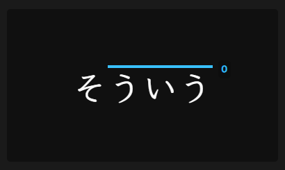

# Reading Display

Hides the reading when a word is written entirely in kana while keeping the pitch accent, preventing redundant information and maintaining a clean layout.

=== "Before"
    

=== "After"
    


**How to Use:**

To enable this feature, you need to edit the `Styling` in your Anki card template.

1.  **Enable Kana Replacement**: Find the `--no-duplicate-kana` variable and set its value to `true`. This will replace a kana word with its reading if they are the same.

    ```css
    --no-duplicate-kana: true;
    ```

2.  **Adjust Pitch Accent Thickness**: If the pitch accent lines appear too thick or thin after the replacement, you can adjust the `--only-kana-pitch-size` variable. A smaller value makes the line thinner, while a larger value makes it thicker.

    ```css
    --only-kana-pitch-size: 0.08em;
    ```
