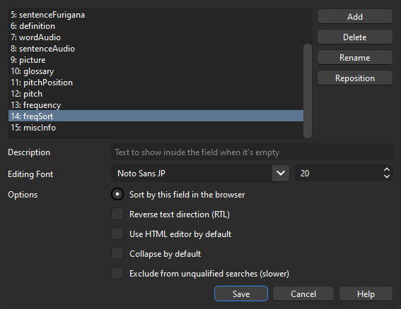

# Setup: Anki

## Frequency Sorting (using AutoReorder Add-on)

To automatically sort newly added cards by frequency:

1.  Install the [AutoReorder](https://ankiweb.net/shared/info/757527607) add-on (`757527607`).
2.  Go to Tools -> AutoReorder Options...
3.  Paste the following configuration:

    ```json
    {
        "search_to_sort": "deck:Senren is:new", // Adjust deck name if needed
        "shift_existing": true,
        "sort_field": "freqSort",
        "sort_reverse": false
    }
    ```
4.  Ensure the `freqSort` field in the Senren note type has "Sort by this field in the browser" checked in Anki's Fields dialog.



## Fonts (Local Installation)

For consistent appearance, especially if using Anki on different devices, you can install the fonts locally within Anki:

1.  Download the font files from the Senren repository's [Fonts folder](https://github.com/BrenoAqua/Senren/tree/main/Fonts).
    *   [`_Hiragino Kaku Gothic ProN W3.otf`](https://github.com/BrenoAqua/Senren/raw/refs/heads/main/Fonts/_Hiragino%20Kaku%20Gothic%20ProN%20W3.otf)
    *   [`_KleeOne-SemiBold.ttf`](https://github.com/BrenoAqua/Senren/raw/refs/heads/main/Fonts/_KleeOne-SemiBold.ttf)
    *   [`_NotoSansJP.ttf`](https://github.com/BrenoAqua/Senren/raw/refs/heads/main/Fonts/_NotoSansJP.ttf) (Fallback for Hiragino)
    *   [`_NotoSerifJP.ttf`](https://github.com/BrenoAqua/Senren/raw/refs/heads/main/Fonts/_NotoSerifJP.ttf) (Fallback for Klee)
2.  Place the downloaded font files (starting with `_`) into your Anki profile's `collection.media` folder. Path usually looks like: 
    *   `C:\Users\[YourUsername]\AppData\Roaming\Anki2\[YourProfileName]\collection.media` (Windows) 
    *   `~/Library/Application Support/Anki2/[YourProfileName]/collection.media` (macOS)

## Recommended Add-ons

*   **Must Have:**
    *   [AnkiConnect](https://ankiweb.net/shared/info/2055492159) (`2055492159`)
*   **Recommended:**
    *   [Local Audio Server for Yomichan](https://ankiweb.net/shared/info/1045800357) (`1045800357`)
    *   [Edit Field During Review](https://ankiweb.net/shared/info/1020366288) (`1020366288`)
    *   [AnkiWebView Inspector](https://ankiweb.net/shared/info/31746032) (`31746032`)
    *   [Batch Editing](https://ankiweb.net/shared/info/291119185) (`291119185`)
    *   [AutoReorder](https://ankiweb.net/shared/info/757527607) (`757527607`)
