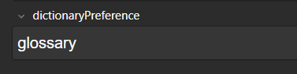

# Definition Toggle

Switch between multiple definitions or glossaries using buttons or arrow keys.

*   **Save Preference:** Set whether the glossary or the main definition appears first by default. Add `glossary` to the `dictionaryPreference` field to show the glossary first.

    

    Use the [Batch Editing](https://ankiweb.net/shared/info/291119185) add-on to update multiple cards at once.
    
    **Remember Last View:** The last viewed dictionary/glossary tab remains active until Anki is restarted.
