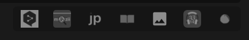

Clicking any of these buttons will redirect you to the respective site and search for the target word automatically.

Supported Sites:

*   [JPDB](https://jpdb.io/)
*   [Jisho](https://jisho.org/)
*   [Google Images](https://images.google.com/)
*   [Nadeshiko](https://nadeshiko.co/)
*   [Immersion Kit](https://v2.immersionkit.com/)

To completely remove the External Links go to the `/* Component Visibility */` section of the CSS:
```css
  --external-links-visibility:        1; /* "0" to hide external links */
```
It’s enabled by default. Change to `0` to disable.

If you want to add or remove any of the supported sites, go to the `<!-- External Links -->` section of the Back Template.
```html
      <!-- Jpdb -->
      <a data-details="jpdb.io" href="https://jpdb.io/search?q={{text:word}}">
        
        
      </a>

      <!-- Jisho -->
      <a data-details="jisho.org" href="https://jisho.org/search/{{text:word}}">
        
        
      </a>

      <!-- Google Images -->
      <a data-details="image_search" href="https://www.google.co.jp/search?q={{text:word}}&amp;tbm=isch">
        
        
      </a>

      <!-- Nadeshiko -->
      <a data-details="nadeshiko.co" href="https://nadeshiko.co/search/sentence?query={{text:word}}">
        
        
      </a>

      <!-- Immersion Kit -->
      <a data-details="immersionkit.com" href="https://immersionkit.com/dictionary?keyword={{text:word}}">
        
        
      </a>
```

Template for adding a new site:

```html
    <!-- Site Name -->
      <a data-details="example.com" href="https://example.com/search?q={{text:word}}">
         
        
      </a>
```
!!! warning "Icon Location Folder"
Your new site icon should be placed inside the `%appdata%\Anki2\[YourUsername]\collection.media` folder, Don’t forget to add an underscore (`_`) at the start of the file name, like `_icon_example_dark.png`.
