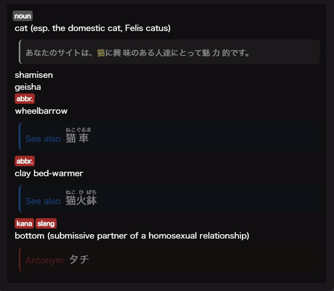

# Stylization Changes for Jitendex (and similar dictionaries)

Enhanced display for dictionary entries, particularly those generated by Yomitan with structured data.

## Click Interactions
*   Example sentences smoothly expand/collapse on **click**, and their border color is highlighted when in the expanded state.

## Hover Interactions
*   Antonyms, cross-references, and notes smoothly expand/collapse on **hover**.
*   Furigana appears smoothly on example sentences when **hovered**.
*   Elements start with 50% opacity and transition to full opacity (100%) when **hovered**.

    

## Visual & Formatting Tweaks:
*   **Highlighted Keywords:** Target words in examples match the note type's bold color style.
*   **Glossary List Formatting:** Improved readability for lists of related words or terms within glossary entries.
<<<<<<< HEAD
*   **Hidden Sections:** Attribution and forms sections are hidden by default.
=======
*   **Hidden Sections:** Attribution and forms sections are hidden by default.
>>>>>>> 5d45d5a31ff8fbfeda99d24bde25decb41c4889a
