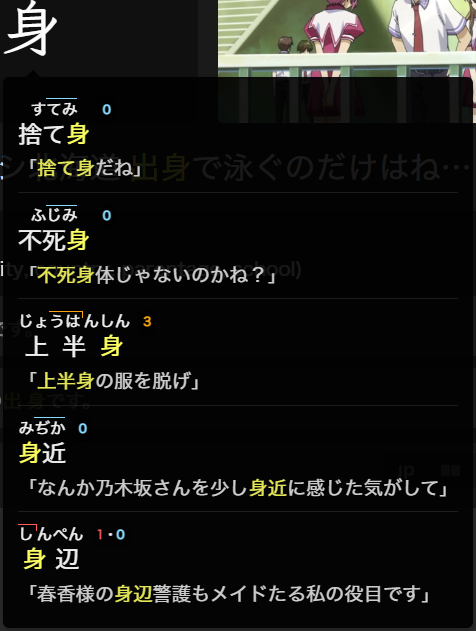

# Kanji Hover

Hover over any kanji within a word to see up to 5 other words in your collection that use the same kanji. A "Show More" option appears if more cards exist.

{ width="300" }

!!! note "PC Only"
    This feature currently only works on the desktop version of Anki.