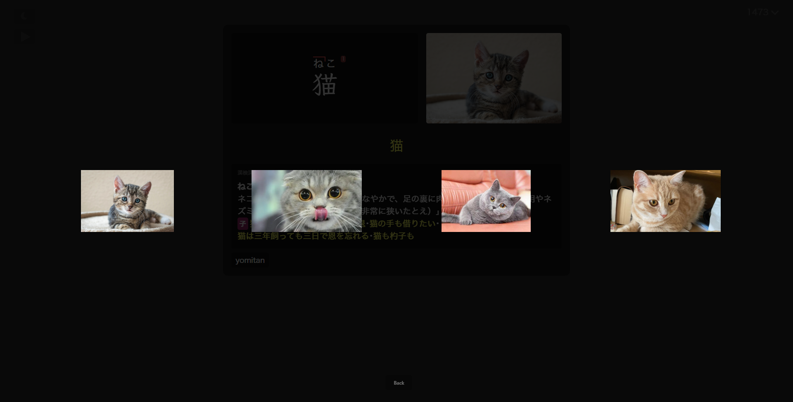

# Picture Lightbox

Click the image to view it in an enlarged, focused lightbox overlay.

*   **Zoom & Pan:** Zoom follows the cursor; click and drag to pan the zoomed image.
*   **Multiple Images:** If multiple images are present (e.g., in the `picture` field or detected in glossary entries), you can navigate between them using arrow keys or on-screen buttons. Only the first image shows in the main card view.
*   **Glossary Images:** Images found within glossary definitions (like those from 画像付き-絵でわかる日本語) can be displayed in the lightbox.
*   **Lightbox Grid View:** Toggle between the default single-image view and a grid view showing thumbnails of all available images.

    === "Preview 1"
        

    === "Preview 2"
        

    === "Default View"
        

    === "Grid View"
        

*   **Default Shortcuts:** 
    * **Q**: Toggle lightbox
    * **Shift+Q**: Toggle lightbox grid view

    You can change these in the `/* CUSTOM SHORTCUTS */` section of the CSS:

    ```css
    --toggle-picture-lightbox-key:      q;       /* Set the key to toggle lightbox */
    --toggle-picture-lightbox-grid-key: shift+q; /* Set the key to toggle lightbox grid */
    ```
