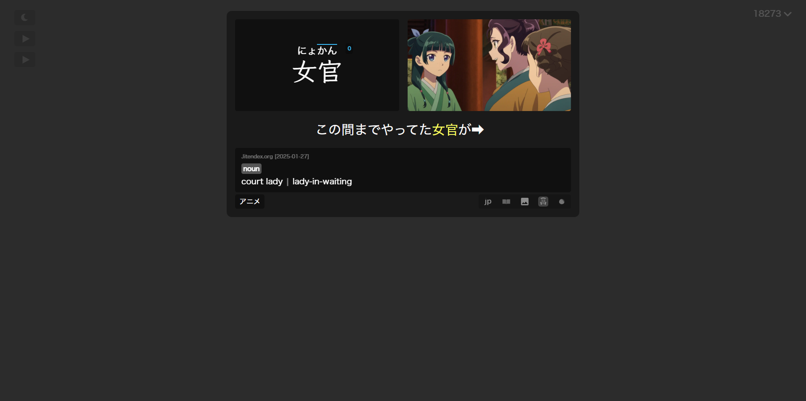

## Responsive Layout For Different Screen Sizes

The layout automatically adjusts based on screen width for optimal viewing.

*   **Default (> 1050px):** 2-column layout.
*   **Large (≤ 1050px):** 2-column layout (similar to Default but may adjust spacing).
*   **Medium (≤ 768px):** Still 2-column layout (effectively same as Large).
*   **Small (≤ 624px):** Switches to a single-column layout.

    === "Default"
        

    === "Large"
        { width="481" }

    === "Small"
        { width="296.3" }

!!! info "Customizable Layouts"
    All layouts are fully customizable via CSS variables. You can switch between 1/2 columns, flip content direction, hide sections, or remove headers/footers entirely.
