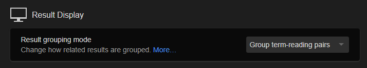
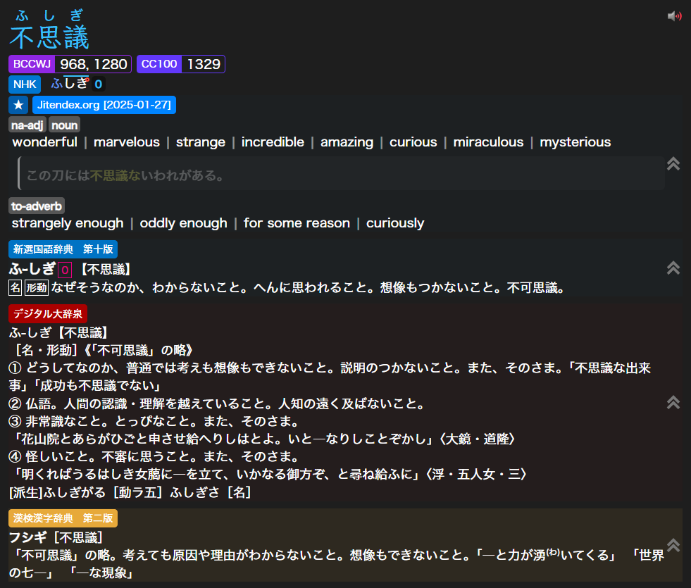

# Setup: Anki

Configure Yomitan to automatically populate Senren's fields when creating cards.

## Fields Configuration

In Yomitan Settings -> Anki -> Configure Anki Flashcards:

| Field                 | Value                                                                       | Note         |
|-----------------------|-----------------------------------------------------------------------------|--------------|
|  word                 | `{expression}`                                                              |              |
|  sentence             | `{cloze-prefix}<span class="highlight">{cloze-body}</span>{cloze-suffix}`   |              |
|  sentenceFurigana     | `{sentence-furigana}`                                                       | Or `{sentence-furigana-plain}` if you prefer. |
|  sentenceEng          |                                                                             | Leave empty. |
|  reading              | `{pitch-accents}`                                                           |              |
|  sentenceCard         |                                                                             | Leave empty. |
|  audioCard            |                                                                             | Leave empty. |
|  notes                |                                                                             | Leave empty. | 
|  selectionText        | `{popup-selection-text}`                                                    | The selected text from the search page or popup takes priority over the dictionary in the `definition` field. If no text is selected, it doesn't do anything.               |
|  definition           | `{single-glossary-jitendexorg-2025-04-11}`                                  | Set your primary dictionary here. |
|  wordAudio            | `{audio}`                                                                   |              |
|  sentenceAudio        |                                                                             | Leave empty. |
|  picture              | `{clipboard-image}`                                                         |              |
|  glossary             | `{glossary}`                                                                | There are two ways to use this field. The first is by setting it to `{glossary}`, this will extract definitions from all your dictionaries. <br> The second is by setting it to specific dictionaries (e.g. `{single-glossary-新選国語辞典-第十版}{single-glossary-デジタル大辞泉}{single-glossary-漢検漢字辞典-第二版}`), which will include only the selected ones. <br><br> This requires "Group term-reading pairs" or "Group related terms" to be enabled in Result Display [(see below)](#result-display-setting). [Dictionaries I use](https://drive.google.com/drive/folders/1OgCWBif-wnN5iz8k1oi_UQdB0_niDud4?usp=sharing). |
|  pitchPosition        | `{pitch-accent-positions}`                                                  | Requires [pitch accent dictionaries](https://drive.google.com/drive/folders/1dMjjHX7_rnTKCHU3btnQReM9M4f2Sirr?usp=sharing). |
|  pitch                | `{pitch-accent-categories}`                                                 | Uses same [pitch accent dictionaries](https://drive.google.com/drive/folders/1dMjjHX7_rnTKCHU3btnQReM9M4f2Sirr?usp=sharing). |
|  frequency            | `{frequencies}`                                                             | Requires [frequency dictionaries](https://drive.google.com/drive/folders/1cJn4lw-a-YollDJvEkfUyRcel6QndFDN?usp=sharing). |
|  freqSort             | `{frequency-harmonic-rank}`                                                 | Used for sorting new cards. Uses same [frequency dictionaries](https://drive.google.com/drive/folders/1cJn4lw-a-YollDJvEkfUyRcel6QndFDN?usp=sharing). |
|  miscInfo             | `{document-title}`                                                          | Captures the source web page title. Leave empty if using mpvacious or similar tools that populate this. |
|  dictionaryPreference |                                                                             | Enter `glossary` to show the glossary first, leave it empty to show the `definition` first, or enter a dictionary name to prioritize it (e.g., `新選国語辞典　第十版`). If Jitendex is your main dictionary but you want another one for a specific card, edit this field in **Anki** and it will take priority without using Selection Text. <br><br> Use [Batch Editing add-on](https://ankiweb.net/shared/info/291119185) to update existing cards. |

## Result Display Setting

Crucially, for the `glossary` field to work correctly with multiple dictionaries listed, you need to enable grouping in Yomitan:

Go to **Yomitan Settings** -> **Appearance** -> **Result Display** and select either:

*   **Group term-reading pairs** OR
*   **Group related terms**



## Handlebars Template (Optional)

This Handlebars template displays the **Reading (kana)** as fallback for words lacking pitch data.

* Go to Yomitan Settings -> Anki -> Configure Anki card Templates...
* Select all existing content in the template editor.
* Replace it with the following code:

??? note "Click to expand Handlebars code"

    ```handlebars
    {{#*inline "glossary-single"}}
        {{~#unless brief~}}
            {{~#scope~}}
                {{~set "any" false~}}
                {{~#each definitionTags~}}
                    {{~#if (op "||" (op "!" @root.compactTags) (op "!" redundant))~}}
                        {{~#if (get "any")}}, {{else}}<i>({{/if~}}
                        {{name}}
                        {{~set "any" true~}}
                    {{~/if~}}
                {{~/each~}}
                {{~#unless noDictionaryTag~}}
                    {{~#if (op "||" (op "!" @root.compactTags) (op "!==" dictionary (get "previousDictionary")))~}}
                        {{~#if (get "any")}}, {{else}}<i>({{/if~}}
                        {{dictionaryAlias}}
                        {{~set "any" true~}}
                    {{~/if~}}
                {{~/unless~}}
                {{~#if (get "any")}})</i> {{/if~}}
            {{~/scope~}}
            {{~#if only~}}({{#each only}}{{.}}{{#unless @last}}, {{/unless}}{{/each}} only) {{/if~}}
        {{~/unless~}}
        {{~#if (op "<=" glossary.length 1)~}}
            {{#each glossary}}{{formatGlossary ../dictionary .}}{{/each}}
        {{~else if @root.compactGlossaries~}}
            {{#each glossary}}{{formatGlossary ../dictionary .}}{{#unless @last}} | {{/unless}}{{/each}}
        {{~else~}}
            <ul>{{#each glossary}}<li>{{formatGlossary ../dictionary .}}</li>{{/each}}</ul>
        {{~/if~}}
        {{~set "previousDictionary" dictionary~}}
    {{/inline}}
    
    {{#*inline "audio"}}
        {{~#if (hasMedia "audio")~}}
            [sound:{{getMedia "audio"}}]
        {{~/if~}}
    {{/inline}}
    
    {{#*inline "character"}}
        {{~definition.character~}}
    {{/inline}}
    
    {{#*inline "dictionary"}}
        {{~definition.dictionary~}}
    {{/inline}}
    
    {{#*inline "dictionary-alias"}}
        {{~definition.dictionaryAlias~}}
    {{/inline}}
    
    {{#*inline "expression"}}
        {{~#if merge~}}
            {{~#each definition.expression~}}
                {{{.}}}
                {{~#unless @last}}、{{/unless~}}
            {{~/each~}}
        {{~else~}}
            {{definition.expression}}
        {{~/if~}}
    {{/inline}}
    
    {{#*inline "furigana"}}
        {{~#if merge~}}
            {{~#each definition.expressions~}}
                <span class="expression-{{termFrequency}}">{{~furigana .~}}</span>
                {{~#unless @last}}、{{/unless~}}
            {{~/each~}}
        {{~else~}}
            {{furigana definition}}
        {{~/if~}}
    {{/inline}}
    
    {{#*inline "furigana-plain"}}
        {{~#if merge~}}
            {{~#each definition.expressions~}}
                <span class="expression-{{termFrequency}}">{{~furiganaPlain .~}}</span>
                {{~#unless @last}}、{{/unless~}}
            {{~/each~}}
        {{~else~}}
            {{furiganaPlain definition}}
        {{~/if~}}
    {{/inline}}
    
    {{~#*inline "glossary"~}}
        <div style="text-align: left;" class="yomitan-glossary">
        {{~#scope~}}
            {{~#if (op "===" definition.type "term")~}}
                {{~#unless (op "&&" selectedDictionary (op "!=" selectedDictionary definition.dictionary))~}}
                    {{~> glossary-single definition brief=brief noDictionaryTag=noDictionaryTag ~}}
                    {{~#if definition.glossaryScopedStyles~}}
                        <style>{{{definition.glossaryScopedStyles}}}</style>
                    {{~/if~}}
                {{~/unless~}}
            {{~else if (op "||" (op "===" definition.type "termGrouped") (op "===" definition.type "termMerged"))~}}
                <ol>
                    {{~#each definition.definitions~}}
                        {{~#unless (op "&&" ../selectedDictionary (op "!=" ../selectedDictionary dictionary))~}}
                            <li data-dictionary="{{dictionary}}">
                                {{~> glossary-single . brief=../brief noDictionaryTag=../noDictionaryTag ~}}
                            </li>
                            {{~#if dictScopedStyles~}}
                                <style>{{{dictScopedStyles}}}</style>
                            {{~/if~}}
                        {{~/unless~}}
                    {{~/each~}}
                </ol>
            {{~else if (op "===" definition.type "kanji")~}}
                {{~#if (op ">" definition.glossary.length 1)~}}
                    <ol>{{#each definition.glossary}}<li>{{.}}</li>{{/each}}</ol>
                {{~else~}}
                    {{~#each definition.glossary~}}{{.}}{{~/each~}}
                {{~/if~}}
            {{~/if~}}
        {{~/scope~}}
        </div>
    {{~/inline~}}
    
    {{#*inline "glossary-no-dictionary"}}
        {{~> glossary noDictionaryTag=true ~}}
    {{/inline}}
    
    {{#*inline "glossary-brief"}}
        {{~> glossary brief=true ~}}
    {{/inline}}
    
    {{~#*inline "glossary-plain"~}}
        {{~#scope~}}
            {{~#each definition.definitions~}}
                {{~#unless (op "&&" ../selectedDictionary (op "!=" ../selectedDictionary dictionary))~}}
                    {{~#unless ../noDictionaryTag~}}
                        ({{dictionaryAlias}})<br>
                    {{~/unless~}}
                    {{#each glossary}}{{{formatGlossaryPlain ../dictionary .}}}{{#unless @last}}<br>{{/unless}}{{/each}}{{#unless @last}}<br>{{/unless}}
                {{~/unless~}}
            {{~/each~}}
        {{~/scope~}}
    {{~/inline~}}
    
    {{#*inline "glossary-plain-no-dictionary"~}}
        {{~> glossary-plain noDictionaryTag=true ~}}
    {{/inline}}
    
    {{~#*inline "glossary-first"~}}
        <div style="text-align: left;" class="yomitan-glossary">
        {{~#scope~}}
            {{~#if (op "===" definition.type "term")~}}
                {{~> glossary-single definition brief=brief noDictionaryTag=noDictionaryTag ~}}
                {{~#if definition.glossaryScopedStyles~}}
                    <style>{{{definition.glossaryScopedStyles}}}</style>
                {{~/if~}}
            {{~else if (op "||" (op "===" definition.type "termGrouped") (op "===" definition.type "termMerged"))~}}
                {{~#if (op ">" definition.definitions.length 1)~}}
                    {{~#with definition.definitions.[0]~}}
                        {{~> glossary-single . brief=../brief noDictionaryTag=../noDictionaryTag ~}}
                        {{~#if glossaryScopedStyles~}}
                            <style>{{{glossaryScopedStyles}}}</style>
                        {{~/if~}}
                    {{~/with~}}
                {{~else~}}
                    {{~#with definition.definitions.[0]~}}
                        {{~> glossary-single . brief=../brief noDictionaryTag=../noDictionaryTag ~}}
                        {{~#if glossaryScopedStyles~}}
                            <style>{{{glossaryScopedStyles}}}</style>
                        {{~/if~}}
                    {{~/with~}}
                {{~/if~}}
            {{~/if~}}
        {{~/scope~}}
        </div>
    {{~/inline~}}
    
    {{#*inline "glossary-first-no-dictionary"}}
        {{~> glossary-first noDictionaryTag=true ~}}
    {{/inline}}
    
    {{#*inline "glossary-first-brief"}}
        {{~> glossary-first brief=true ~}}
    {{/inline}}
    
    {{#*inline "kunyomi"}}
        {{~#each definition.kunyomi}}{{.}}{{#unless @last}}, {{/unless}}{{/each~}}
    {{/inline}}
    
    {{#*inline "onyomi"}}
        {{~#each definition.onyomi}}{{.}}{{#unless @last}}, {{/unless}}{{/each~}}
    {{/inline}}
    
    {{#*inline "onyomi-hiragana"}}
        {{~#each definition.onyomi}}{{hiragana .}}{{#unless @last}}, {{/unless}}{{/each~}}
    {{/inline}}
    
    {{#*inline "reading"}}
        {{~#if merge~}}
            {{~#each definition.reading~}}
                {{{.}}}
                {{~#unless @last}}、{{/unless~}}
            {{~/each~}}
        {{~else~}}
            {{~definition.reading~}}
        {{~/if~}}
    {{/inline}}
    
    {{#*inline "sentence"}}
        {{~#if definition.cloze}}{{{definition.cloze.sentence}}}{{/if~}}
    {{/inline}}
    
    {{#*inline "cloze-prefix"}}
        {{~#if definition.cloze}}{{{definition.cloze.prefix}}}{{/if~}}
    {{/inline}}
    
    {{#*inline "cloze-body"}}
        {{~#if definition.cloze}}{{{definition.cloze.body}}}{{/if~}}
    {{/inline}}
    
    {{#*inline "cloze-body-kana"}}
        {{~#if definition.cloze}}{{{definition.cloze.bodyKana}}}{{/if~}}
    {{/inline}}
    
    {{#*inline "cloze-suffix"}}
        {{~#if definition.cloze}}{{{definition.cloze.suffix}}}{{/if~}}
    {{/inline}}
    
    {{#*inline "tags"}}
        {{~#mergeTags definition group merge}}{{this}}{{/mergeTags~}}
    {{/inline}}
    
    {{~#*inline "url"~}}
        <a href="{{definition.url}}">{{definition.url}}</a>
    {{~/inline~}}
    
    {{#*inline "screenshot"}}
        {{~#if (hasMedia "screenshot")~}}
            
        {{~/if~}}
    {{/inline}}
    
    {{#*inline "document-title"}}
        {{~context.document.title~}}
    {{/inline}}
    
    {{! Pitch Accents }}
    {{#*inline "pitch-accent-item"}}
        {{~pronunciation format=format reading=reading pitchPositions=positions nasalPositions=nasalPositions devoicePositions=devoicePositions~}}
    {{/inline}}
    
    {{#*inline "pitch-accent-item-disambiguation"}}
        {{~#scope~}}
            {{~set "exclusive" (spread exclusiveExpressions exclusiveReadings)~}}
            {{~#if (op ">" (property (get "exclusive") "length") 0)~}}
                {{~set "separator" ""~}}
                <em>({{#each (get "exclusive")~}}
                    {{~get "separator"~}}{{{.}}}
                {{~/each}} only) </em>
            {{~/if~}}
        {{~/scope~}}
    {{/inline}}
    
    {{#*inline "pitch-accent-list"}}
        {{~#if (op ">" pitchCount 0)~}}
            {{~#if (op ">" pitchCount 1)~}}<ol>{{~/if~}}
            {{~#each pitches~}}
                {{~#each pitches~}}
                    {{~#if (op ">" ../../pitchCount 1)~}}<li>{{~/if~}}
                        {{~> pitch-accent-item-disambiguation~}}
                        {{~> pitch-accent-item format=../../format~}}
                    {{~#if (op ">" ../../pitchCount 1)~}}</li>{{~/if~}}
                {{~/each~}}
            {{~/each~}}
            {{~#if (op ">" pitchCount 1)~}}</ol>{{~/if~}}
        {{~/if~}}
    {{/inline}}
    
    {{#*inline "pitch-accents"}}
        {{#if (op ">" pitchCount 0)}}
            {{~> pitch-accent-list format='text'~}}
        {{else}}
            {{~definition.reading~}}
        {{/if}}
    {{/inline}}
    
    {{#*inline "pitch-accent-graphs"}}
        {{~> pitch-accent-list format='graph'~}}
    {{/inline}}
    
    {{#*inline "pitch-accent-graphs-jj"}}
        {{~> pitch-accent-list format='graph-jj'~}}
    {{/inline}}
    
    {{#*inline "pitch-accent-positions"}}
        {{~> pitch-accent-list format='position'~}}
    {{/inline}}
    
    {{~#*inline "pitch-accent-categories"~}}
        {{~#each (pitchCategories @root)~}}{{~.~}}{{~#unless @last~}},{{~/unless~}}{{~/each~}}
    {{~/inline~}}
    {{! End Pitch Accents }}
    
    {{#*inline "phonetic-transcriptions"}}
        {{~#if (op ">" definition.phoneticTranscriptions.length 0)~}}
            <ul>
                {{~#each definition.phoneticTranscriptions~}}
                    {{~#each phoneticTranscriptions~}}
                        <li class="pronunciation" data-pronunciation-type="phonetic-transcription">
                            {{~set "any" false~}}
                            {{~#each tags~}}
                                {{~#if (get "any")}}, {{else}}<i>({{/if~}}
                                <span class="tag" data-details="{{name}}">{{name}}</span>
                                {{~set "any" true~}}
                            {{~/each~}}
                            {{~#if (get "any")}})</i> {{/if~}}
                            {{ipa~}}
                        </li>
                    {{~/each~}}
                {{~/each~}}
            </ul>
        {{~/if~}}
    {{/inline}}
    
    {{#*inline "clipboard-image"}}
        {{~#if (hasMedia "clipboardImage")~}}
            
        {{~/if~}}
    {{/inline}}
    
    {{#*inline "clipboard-text"}}
        {{~#if (hasMedia "clipboardText")}}{{{getMedia "clipboardText"}}}{{/if~}}
    {{/inline}}
    
    {{#*inline "conjugation"}}
        {{~#if (op ">" definition.inflectionRuleChainCandidates.length 0)~}}
            {{~set "multiple" false~}}
            {{~#if (op ">" definition.inflectionRuleChainCandidates.length 1)~}}
                {{~set "multiple" true~}}
            {{~/if~}}
            {{~#if (get "multiple")~}}<ul>{{/if~}}
                {{~#each definition.inflectionRuleChainCandidates~}}
                    {{~#if (op ">" inflectionRules.length 0)~}}
                        {{~#if (get "multiple")~}}<li>{{/if~}}
                        {{~#each inflectionRules~}}
                            {{~#if (op ">" @index 0)}} « {{/if~}}
                            {{name}}
                        {{~/each~}}
                        {{~#if (get "multiple")~}}</li>{{/if~}}
                    {{~/if~}}
                {{~/each~}}
            {{~#if (get "multiple")~}}</ul>{{/if~}}
        {{~/if~}}
    {{/inline}}
    
    {{#*inline "frequencies"}}
        {{~#if (op ">" definition.frequencies.length 0)~}}
            <ul style="text-align: left;">
            {{~#each definition.frequencies~}}
                {{~#unless (op "&&" ../selectedDictionary (op "!=" ../selectedDictionary dictionary))~}}
                    <li>
                    {{~#if (op "!==" ../definition.type "kanji")~}}
                        {{~#if (op "||" (op ">" ../uniqueExpressions.length 1) (op ">" ../uniqueReadings.length 1))~}}(
                            {{~furigana expression reading~}}
                        ) {{/if~}}
                    {{~/if~}}
                    {{~dictionaryAlias}}: {{frequency~}}
                    </li>
                {{~/unless~}}
            {{~/each~}}
            </ul>
        {{~/if~}}
    {{/inline}}
    
    {{#*inline "single-frequency-number"}}
        {{~#if (op ">" definition.frequencyNumbers.length 0)~}}
            {{~#each definition.frequencyNumbers~}}
                {{~#unless (op "&&" ../selectedDictionary (op "!=" ../selectedDictionary dictionary))~}}
                        {{frequency~}}
                {{~/unless~}}
            {{~/each~}}
        {{/if}}
    {{/inline}}
    
    {{#*inline "frequency-harmonic-rank"}}
        {{~#if (op "===" definition.frequencyHarmonic -1) ~}}
            9999999
        {{~else ~}}
            {{definition.frequencyHarmonic}}
        {{~/if~}}
    {{/inline}}
    
    {{#*inline "frequency-harmonic-occurrence"}}
        {{~#if (op "===" definition.frequencyHarmonic -1) ~}}
            0
        {{~else ~}}
            {{definition.frequencyHarmonic}}
        {{~/if~}}
    {{/inline}}
    
    {{#*inline "frequency-average-rank"}}
        {{~#if (op "===" definition.frequencyAverage -1) ~}}
            9999999
        {{~else ~}}
            {{definition.frequencyAverage}}
        {{~/if~}}
    {{/inline}}
    
    {{#*inline "frequency-average-occurrence"}}
        {{~#if (op "===" definition.frequencyAverage -1) ~}}
            0
        {{~else ~}}
            {{definition.frequencyAverage}}
        {{~/if~}}
    {{/inline}}
    
    {{#*inline "stroke-count"}}
        {{~#scope~}}
            {{~set "found" false~}}
            {{~#each definition.stats.misc~}}
                {{~#if (op "===" name "strokes")~}}
                    {{~set "found" true~}}
                    Stroke count: {{value}}
                {{~/if~}}
            {{~/each~}}
            {{~#if (op "!" (get "found"))~}}
                Stroke count: Unknown
            {{~/if~}}
        {{~/scope~}}
    {{/inline}}
    
    {{#*inline "part-of-speech-pretty"}}
        {{~#if (op "===" . "v1")~}}Ichidan verb
        {{~else if (op "===" . "v5")~}}Godan verb
        {{~else if (op "===" . "vk")~}}Kuru verb
        {{~else if (op "===" . "vs")~}}Suru verb
        {{~else if (op "===" . "vz")~}}Zuru verb
        {{~else if (op "===" . "adj-i")~}}I-adjective
        {{~else if (op "===" . "n")~}}Noun
        {{~else~}}{{.}}
        {{~/if~}}
    {{/inline}}
    
    {{#*inline "part-of-speech"}}
        {{~#scope~}}
            {{~#if (op "!==" definition.type "kanji")~}}
                {{~set "first" true~}}
                {{~#each definition.expressions~}}
                    {{~#each wordClasses~}}
                        {{~#unless (get (concat "used_" .))~}}
                            {{~> part-of-speech-pretty . ~}}
                            {{~#unless (get "first")}}, {{/unless~}}
                            {{~set (concat "used_" .) true~}}
                            {{~set "first" false~}}
                        {{~/unless~}}
                    {{~/each~}}
                {{~/each~}}
                {{~#if (get "first")~}}Unknown{{~/if~}}
            {{~/if~}}
        {{~/scope~}}
    {{/inline}}
    
    {{#*inline "search-query"}}
        {{~#multiLine}}{{context.fullQuery}}{{/multiLine~}}
    {{/inline}}
    
    {{#*inline "popup-selection-text"}}
        {{~#if (hasMedia "popupSelectionText")}}{{{getMedia "popupSelectionText"}}}{{/if~}}
    {{/inline}}
    
    {{#*inline "sentence-furigana"}}
        {{~#if definition.cloze~}}
            {{~#if (hasMedia "textFurigana" definition.cloze.sentence)~}}
                {{{getMedia "textFurigana" definition.cloze.sentence escape=false}}}
            {{~else~}}
                {{{definition.cloze.sentence}}}
            {{~/if~}}
        {{~/if~}}
    {{/inline}}
    
    {{#*inline "sentence-furigana-plain"}}
        {{~#if definition.cloze~}}
            {{~#if (hasMedia "textFuriganaPlain" definition.cloze.sentence)~}}
                {{{getMedia "textFuriganaPlain" definition.cloze.sentence escape=false}}}
            {{~else~}}
                {{{definition.cloze.sentence}}}
            {{~/if~}}
        {{~/if~}}
    {{/inline}}
    
    {{~> (lookup . "marker") ~}}
    ```

## CSS Template (Optional) 

* Go to Yomitan Settings -> Appearance -> Configure Custom CSS...
* Select all existing content in the template editor.
* Replace it with the following code:

??? note "Click to expand CSS code"

    ```css
    :root[data-theme="dark"] {
      --background-color: #101010;
      --dict-color-opacity: 100%;
      --dict-color: var(--tag-dictionary-background-color);
      --dict-bg-opacity: 0;
      --tag-text-color: white;
      --tag-border-color: transparent --tag-default-background-color: rgba(0, 0, 0, 0.4);
      --tag-name-background-color: #88C0D0;
      --tag-expression-background-color: #88C0D0;
      --tag-archaism-background-color: #88C0D0;
      --tag-dictionary-background-color: #8FBCBB;
      --tag-frequency-background-color: #81A1C1;
      --tag-part-of-speech-background-color: #88C0D0;
      --tag-search-background-color: #88C0D0;
      --tag-pitch-accent-dictionary-background-color: #5E81AC;
      --text-color: white;
      --pitch-accent-annotation-color: #ebffff;
      --reason-text-color: #5E81AC;
      --notification-text-color: #ebffff;
      --notification-background-color: #3B4252;
      --progress-bar-track-color: #D8DEE9;
      --sidebar-background-color: #2E3440;
      --sidebar-button-background-color: transparent;
      --sidebar-button-background-color-hover: #81A1C1;
      --sidebar-button-background-color-active: #6d88a3;
      --sidebar-button-danger-background-color: transparent;
      --sidebar-button-danger-background-color-hover: #BF616A;
      --sidebar-button-danger-background-color-active: #8a373f;
      --sidebar-button-icon-color: #ebffff;
      --sidebar-button-disabled-icon-color: #808c8c;
      --sidebar-button-danger-icon-color: #ebffff;
      --list-padding1: 0;
    
      /* Marked Mora */
      --devoiced-color: cornflowerBlue;
      --nasal-color: #FF4936;
    
      /* Pitch Accent Colors */
      --pitch-red: #F5436D;
      --pitch-blue: #39C1FF;
      --pitch-orange: #fca311;
      --pitch-green: #40D4A6;
      --pitch-purple: #afa2ff;
    
      /* Fonts */
      --font-sans: hiragino kaku gothic proN;
      --font-serif: klee one;
    }
    
    /* Base Settings */
    body {
      font-family: var(--font-sans);
      line-height: 1.4;
    }
    
    .content-body {
      font-size: 18px;
    }
    
    .headword {
      font-family: var(--font-serif);
      font-size: 1.2rem;
      font-weight: bold;
    }
    
    .headword-kanji-link {
      text-decoration: none;
    }
    
    .source-text rt {
      font-family: var(--font-sans);
      font-weight: normal;
    }
    
    ul,
    ol,
    li {
      list-style: none !important;
    }
    
    ul,
    ol {
      display: inline;
    }
    
    .definition-list {
      padding: 0;
    }
    
    .toggle>input[type=checkbox]:checked+.toggle-body>.toggle-track {
      background: var(--toggle-track-color);
    }
    
    rt.query-parser-segment-reading {
      display: none;
    }
    
    .entry-body-section-content.pronunciation-group-list {
      display: grid;
      grid-gap: 5px;
      margin-bottom: 5px;
    }
    
    .definition-item {
      margin-bottom: 10px;
    }
    
    .gloss-content structured-content {
      margin: 0;
    }
    
    #search-textbox {
      font-size: initial;
    }
    
    /* Inflections Hover */
    .inflection-source-icon,
    .inflection-rule-chains:not(:empty) li {
      display: none;
    }
    
    .inflection-rule-chains:not(:empty)::before {
      content: '🅸';
      cursor: help;
      color: gray;
    }
    
    .inflection-rule-chains:not(:empty):hover li {
      display: block;
    }
    
    .inflection-rule-chain:nth-last-of-type(1) {
      margin-bottom: 0.2em;
    }
    
    /* Dictionary Colorizer */
    .definition-item {
      background-color: color-mix(in srgb,
          var(--dict-color) calc(var(--dict-bg-opacity) * var(--dict-color-opacity)),
          var(--background-color));
      --tag-dictionary-background-color: var(--dict-color);
    }
    
    .definition-item[data-dictionary^="旺文社国語辞典"] {
      --dict-color: rgb(187, 255, 255);
      --dict-bg-opacity: 0.06;
      --tag-text-color: black;
    }
    
    .definition-item[data-dictionary^="明鏡国語辞典"] {
      --dict-color: rgb(51, 51, 221);
      --dict-bg-opacity: 0.03;
    }
    
    .definition-item[data-dictionary^="岩波国語辞"] {
      --dict-color: rgb(51, 85, 51);
      --dict-bg-opacity: 0.05;
    }
    
    .definition-item[data-dictionary*="新明解"] {
      --dict-color: rgb(255, 0, 0);
      --dict-bg-opacity: 0.025;
    }
    
    .definition-item[data-dictionary^="大辞林"] {
      --dict-color: rgb(85, 34, 85);
      --dict-bg-opacity: 0.03;
    }
    
    .definition-item[data-dictionary="デジタル大辞泉"] {
      --dict-color: rgb(170, 0, 0);
      --dict-bg-opacity: 0.04;
    }
    
    .definition-item[data-dictionary="精選版　日本国語大辞典"] {
      --dict-color: rgb(238, 238, 204);
      --dict-bg-opacity: 0.05;
      --tag-text-color: black;
    }
    
    .definition-item[data-dictionary="ハイブリッド新辞林"] {
      --dict-color: rgb(221, 221, 238);
      --dict-bg-opacity: 0.15;
      --tag-text-color: black;
    }
    
    .definition-item[data-dictionary^="広辞苑"] {
      --dict-color: rgb(51, 51, 51);
      --dict-bg-opacity: 0.05;
    }
    
    .definition-item[data-dictionary$="辞典オンライン"],
    .definition-item[data-dictionary="故事・ことわざ・慣用句オンライン"] {
      --dict-color: rgb(255, 227, 124);
      --dict-bg-opacity: 0.05;
      --tag-text-color: black;
    }
    
    .definition-item[data-dictionary="実用日本語表現辞典"] {
      --dict-color: rgb(99, 108, 141);
      --dict-bg-opacity: 0.05;
    }
    
    .definition-item[data-dictionary^="三省堂国語辞典"] {
      --dict-color: rgb(229, 107, 57);
      --dict-bg-opacity: 0.03;
    }
    
    .definition-item[data-dictionary^="JMdict"],
    .definition-item[data-dictionary^="JMDict"],
    .definition-item[data-dictionary^="JMnedict"],
    .definition-item[data-dictionary^="Jitendex"] {
      --dict-color: rgb(0, 132, 255);
      --dict-bg-opacity: 0.02;
    }
    
    .definition-item[data-dictionary="NEW斎藤和英大辞典"] {
      --dict-color: rgb(244, 225, 254);
      --dict-bg-opacity: 0.15;
      --tag-text-color: black;
    }
    
    .definition-item[data-dictionary="新和英"] {
      --dict-color: rgb(21, 70, 51);
      --dict-bg-opacity: 0.03;
    }
    
    .definition-item[data-dictionary^="Pixiv"] {
      --dict-color: rgb(0, 151, 250);
      --dict-bg-opacity: 0.03;
    }
    
    .definition-item[data-dictionary="漢字源"] {
      --dict-color: rgb(201, 149, 93);
      --dict-bg-opacity: 0.05;
    }
    
    .definition-item[data-dictionary="日本語俗語辞書"] {
      --dict-color: rgb(176, 4, 157);
      --dict-bg-opacity: 0.05;
    }
    
    .definition-item[data-dictionary="weblio古語辞典"] {
      --dict-color: rgb(193, 123, 148);
      --dict-bg-opacity: 0.05;
    }
    
    .definition-item[data-dictionary="語源由来辞典"] {
      --dict-color: rgb(206, 169, 47);
      --dict-bg-opacity: 0.05;
    }
    
    .definition-item[data-dictionary="学研 四字熟語辞典"] {
      --dict-color: rgb(180, 192, 152);
      --dict-bg-opacity: 0.08;
      --tag-text-color: black;
    }
    
    .definition-item[data-dictionary="故事ことわざの辞典"] {
      --dict-color: rgb(117, 87, 85);
      --dict-bg-opacity: 0.05;
    }
    
    .definition-item[data-dictionary^="日本語文法辞典"] {
      --dict-color: rgb(23, 59, 173);
      --dict-bg-opacity: 0.05;
    }
    
    .definition-item[data-dictionary="絵でわかる日本語"] {
      --dict-color: rgb(207, 76, 110);
      --dict-bg-opacity: 0.05;
    }
    
    .definition-item[data-dictionary="JLPT文法解説まとめ"] {
      --dict-color: rgb(244, 66, 54);
      --dict-bg-opacity: 0.05;
    }
    
    .definition-item[data-dictionary="どんなときどう使う 日本語表現文型辞典"] {
      --dict-color: rgb(126, 168, 232);
      --dict-bg-opacity: 0.08;
    }
    
    .definition-item[data-dictionary="毎日のんびり日本語教師"] {
      --dict-color: rgb(255, 216, 228);
      --dict-bg-opacity: 0.12;
      --tag-text-color: black;
    }
    
    .definition-item[data-dictionary^="新選国語辞典　第十版"] {
      --dict-color: #E5007F !important;
      --dict-bg-opacity: 0.05;
    }
    
    .definition-item[data-dictionary="使い方の分かる 類語例解辞典"],
    .definition-item[data-dictionary="全国方言辞典"] {
      --dict-color: #9c4836;
      --dict-bg-opacity: 0.03;
    }
    
    .definition-item[data-dictionary="新語時事用語辞典"] {
      --dict-color: #6e9ac6;
      --dict-bg-opacity: 0.07;
    }
    
    .definition-item[data-dictionary="漢字ペディア同訓異義"] {
      --dict-color: #b7b7b7;
      --dict-bg-opacity: 0.12;
    }
    
    .definition-item[data-dictionary*="Wikipedia"] {
      --dict-color: #447ff5;
      --dict-bg-opacity: 0.03;
    }
    
    .definition-item[data-dictionary^="漢検漢字辞典"] {
      --dict-color: #e7a93a;
      --dict-bg-opacity: 0.08;
    }
    
    .definition-item[data-dictionary^="例解学習国語辞典"] {
      --dict-color: #faa72f;
      --dict-bg-opacity: 0.05;
    }
    
    .definition-item[data-dictionary^="現代国語例解辞典"] {
      --dict-color: #e3323a;
      --dict-bg-opacity: 0.04;
    }
    
    .tag[data-category="dictionary"][data-details="漢字辞典オンライン"] {
      --tag-color: rgb(255, 227, 124);
      --tag-text-color: black;
    }
    
    .tag[data-category="dictionary"][data-details="JPDB Kanji"] {
      --tag-color: #ff3e3d;
    }
    
    .tag[data-category="dictionary"][data-details="TheKanjiMap Kanji Radicals/Composition"] {
      --tag-color: #2a94c9;
    }
    
    .tag[data-category="dictionary"][data-details*="Wiktionary"] {
      --tag-color: #447ff5;
    }
    
    .tag[data-category="dictionary"][data-details^="KANJIDIC"] {
      --tag-color: rgb(0, 132, 255);
    }
    
    /* Pitch Accent */
    .tag[data-category="pronunciation-dictionary"][data-details="NHK"] {
      --tag-color: #0076d0;
    }
    
    .tag[data-category="pronunciation-dictionary"][data-details^="大辞泉"] {
      --tag-color: rgb(170, 0, 0);
    }
    
    .tag[data-category="pronunciation-dictionary"][data-details^="大辞林"] {
      --tag-color: rgb(85, 34, 85);
    }
    
    /* Frequency Dicts (Also Kanji Dicts) */
    .frequency-group-item[data-details^="JPDB"] {
      --tag-frequency-background-color: #ff3e3d;
    }
    
    .frequency-group-item[data-details^="Innocent"] {
      --tag-frequency-background-color: #e82c9c;
    }
    
    .frequency-group-item[data-details="Novels"] {
      --tag-frequency-background-color: #e537fa;
    }
    
    .frequency-group-item[data-details^="BCCWJ"] {
      --tag-frequency-background-color: #8f27e3;
    }
    
    .frequency-group-item[data-details="CC100"] {
      --tag-frequency-background-color: #6238fa;
    }
    
    .frequency-group-item[data-details="Conversation Corpus"] {
      --tag-frequency-background-color: #273ce3;
    }
    
    .frequency-group-item[data-details^="青空文庫"] {
      --tag-frequency-background-color: #3d93ff;
    }
    
    .frequency-group-item[data-details="Youtube"] {
      --tag-frequency-background-color: #fd0101;
    }
    
    .frequency-group-item[data-details^="Wikipedia"] {
      --tag-frequency-background-color: #447ff5;
    }
    
    /* Frequency hover (average enabled) */
    [data-average-frequency="true"] [data-section-type="frequencies"]:active .frequency-group-item:not([data-details="Average"]) {
      display: inline-block;
    }
    
    [data-average-frequency="true"] [data-section-type="frequencies"]:active .frequency-group-item[data-details="Average"] {
      display: none;
    }
    
    /* Frequency hover (average disabled) */
    [data-average-frequency="false"] span.frequency-group-item:nth-child(n + 3) {
      display: none;
    }
    
    [data-average-frequency="false"] [data-section-type="frequencies"]:active 
    span.frequency-group-item:nth-child(n + 3):not([data-details="Average"]) {
      display: inline-block;
    }
    
    /* Pitch Accent Hover */
    li.pronunciation-group:first-child~* {
      display: none;
    }
    
    ol.pronunciation-group-list:active li.pronunciation-group:first-child ~ 
    li.pronunciation-group { 
      display: inline-block; 
    }
    
    
    /* Hide add duplicate */
    button.action-button[title="Add duplicate expression (Alt + E)"] {
      display: none;
    }
    
    /* Hide add reading */
    button.action-button[title="Add reading (Alt + R)"] {
      display: none;
    }
    
    /* Hide tags */
    [data-category="popular"], 
    [data-category="frequent"] {
      display: none;
    }
    
    /* Only show summary for Pixiv */
    [data-sc-pixiv="children"],
    [data-sc-pixiv="related-tags"],
    [data-sc-pixiv="continue-reading"],
    [data-sc-pixiv="nav-header"] {
      display: none;
    }
    
    /* Jitendex Settings */
    [data-dictionary*="Jitendex.org"] {
      li[data-sc-content="sense-group"],
      li[data-sc-content="forms"],
      li[data-sc-content="sense"],
      ul[data-sc-content="glossary"] {
        padding-left: 0 !important;
      }
    }
    
    [data-dictionary*="Jitendex.org"] {
      span[data-sc-class="tag"] {
        margin-right: 0.25em !important;
      }
    }
    
    .definition-item[data-dictionary*="Jitendex"] *[data-sc-content="example-sentence-a"] {
      font-size: 1em !important;
    }
    
    [data-glossary-layout-mode="default"] [data-sc-content="glossary"] {
      display: flex;
      flex-wrap: wrap;
      padding: 0;
      margin: 0;
    }
    
    [data-glossary-layout-mode="default"] [data-sc-content="glossary"] li:not(:last-child)::after {
      content: "|";
      color: rgba(255, 255, 255, 0.5);
      margin: 0 8px;
    }
    
    /* Hide version date */
    .tag[title^="Jitendex"] .tag-label-content {
      font-size: 0;
    }
    
    .tag[title^="Jitendex"] .tag-label-content::after {
      content: "Jitendex";
      font-size: 0.885rem;
    }
    
    /* Example Keyword */
    span[data-sc-content="example-keyword"] {
      color: #FCFF61 !important;
      text-decoration: none !important;
    }
    
    /* Example Sentences */
    [data-sc-content|="example-sentence"] {
      opacity: 0.5;
      display: block;
      transition: opacity 0.3s ease;
    }
    
    [data-sc-content|="example-sentence"]:hover {
      opacity: 1;
      display: block;
    }
    
    [data-sc-content="example-sentence-a"] {
      transition: opacity 0.3s ease;
    }
    
    [data-sc-content="example-sentence-b"] {
      opacity: 0;
      display: none;
      transition: opacity 0.3s ease;
      /* Collapse height initially */
      overflow: hidden;
      /* Hide overflow */
    }
    
    [data-sc-content="example-sentence-a"]:hover+[data-sc-content="example-sentence-b"] {
      opacity: 1;
      display: block;
    }
    
    [data-sc-content="example-sentence-b"]:hover [data-sc-content|="example-sentence"] {
      opacity: 1;
    }
    
    [data-sc-content="example-sentence"] rt {
      opacity: 0;
      transition: opacity ease 0.3s;
    }
    
    [data-sc-content="example-sentence"]:hover rt {
      opacity: 1;
    }
    
    /* Hidden */
    [data-sc-content="forms"] {
      display: none;
    }
    
    div[data-sc-content="attribution"] {
      display: none;
    }
    
    /* Extra */
    [data-sc-content="antonym"],
    [data-sc-content="sense-note"],
    [data-sc-content="xref"] {
      opacity: 0.5;
      transition: opacity 0.3s ease;
    }
    
    [data-sc-content="antonym"]:hover,
    [data-sc-content="sense-note"]:hover,
    [data-sc-content="xref"]:hover {
      opacity: 1;
    }
    
    /* Pitch Accent Colors */
    .pronunciation-mora-line {
      border-top-width: 0.15em !important;
      border-right-width: 0.15em !important;
    }
    
    /* Heiban*/
    html:has(.entry-current .headword[data-is-primary="true"][data-pronunciation-categories^="heiban"]) {
      --accent-color: var(--pitch-blue);
    }
    
    .headword[data-pronunciation-categories^="heiban"],
    .headword[data-pronunciation-categories^="heiban"] rt {
      --headword-text-color: var(--pitch-blue);
      --headword-current-kanji-border-color: var(--pitch-blue);
      --headword-current-kanji-text-color: var(--pitch-blue);
      color: var(--pitch-blue);
    }
    
    .pronunciation:has(.pronunciation-downstep-notation[data-downstep-position="0"]) {
      --pronunciation-annotation-color: var(--pitch-blue);
      & .pronunciation-downstep-notation-number {
         color: var(--pitch-blue);
      }
    }
    
    /* Atamadaka */
    html:has(.entry-current .headword[data-is-primary="true"][data-pronunciation-categories^="atamadaka"]) {
      --accent-color: var(--pitch-red);
    }
    
    .headword[data-pronunciation-categories^="atamadaka"],
    .headword[data-pronunciation-categories^="atamadaka"] rt {
      --headword-text-color: var(--pitch-red);
      --headword-current-kanji-border-color: var(--pitch-red);
      --headword-current-kanji-text-color: var(--pitch-red);
      color: var(--pitch-red);
    }
    
    .pronunciation:has(.pronunciation-downstep-notation[data-downstep-position="1"]) {
      --pronunciation-annotation-color: var(--pitch-red);
      & .pronunciation-downstep-notation-number {
         color: var(--pitch-red);
      }
    }
    
    /* Nakadaka */
    html:has(.entry-current .headword[data-is-primary="true"][data-pronunciation-categories^="nakadaka"]) {
      --accent-color: var(--pitch-orange);
    }
    
    .headword[data-pronunciation-categories^="nakadaka"],
    .headword[data-pronunciation-categories^="nakadaka"] rt {
      --headword-text-color: var(--pitch-orange);
      --headword-current-kanji-border-color: var(--pitch-orange);
      --headword-current-kanji-text-color: var(--pitch-orange);
      color: var(--pitch-orange);
    }
    
    .pronunciation {
      &:has(.pronunciation-mora:not(:last-child)[data-pitch-next="low"]):has(.pronunciation-downstep-notation:not([data-downstep-position="1"])) {
        --pronunciation-annotation-color: var(--pitch-orange) !important;
        & .pronunciation-downstep-notation-number {
          color: var(--pitch-orange) !important;
        }
      }
    }
    
    /* Odaka */
    html:has(.entry-current .headword[data-is-primary="true"][data-pronunciation-categories^="odaka"]) {
      --accent-color: var(--pitch-green);
    }
    
    .headword[data-pronunciation-categories^="odaka"],
    .headword[data-pronunciation-categories^="odaka"] rt {
      --headword-text-color: var(--pitch-green);
      --headword-current-kanji-border-color: var(--pitch-green);
      --headword-current-kanji-text-color: var(--pitch-green);
      color: var(--pitch-green);
    }
    
    .pronunciation {
      &:has(.pronunciation-mora:last-child[data-pitch-next="low"]):not(:has(.pronunciation-downstep-notation[data-downstep-position="1"])) {
        --pronunciation-annotation-color: var(--pitch-green);
        & .pronunciation-downstep-notation-number {
          color: var(--pitch-green);
        }
      }
    }
    
    /* Kifuku */
    html:has(.entry-current .headword[data-is-primary="true"][data-pronunciation-categories^="kifuku"]) {
      --accent-color: var(--pitch-purple);
    }
    
    .headword[data-pronunciation-categories^="kifuku"],
    .headword[data-pronunciation-categories^="kifuku"] rt {
      --headword-text-color: var(--pitch-purple);
      --headword-current-kanji-border-color: var(--pitch-purple);
      --headword-current-kanji-text-color: var(--pitch-purple);
      color: var(--pitch-purple);
    }
    
    /* Downstep Position */
    .pronunciation-downstep-notation-number {
      font-weight: bold;
      font-family: var(--font-sans);
      padding: 2px 5px 2px 5px;
      border-radius: 5px;
      background: rgba(0, 0, 0, 0.2);
      font-size: 0.8em;
      text-align: center;
    }
    
    .pronunciation-downstep-notation-prefix,
    .pronunciation-downstep-notation-suffix {
      display: none;
    }
    
    /* Nasal Mora */
    .pronunciation-nasal-indicator {
      border: 0.1em solid var(--nasal-color);
      width: 0.35em;
      height: 0.35em;
      right: -0.1em;
      top: 0.225em;
    }
    
    /* Devoiced Mora */
    .pronunciation-devoice-indicator {
      display: none;
    }
    
    .pronunciation-mora[data-devoice="true"] {
      color: var(--devoiced-color);
    }
    ```

