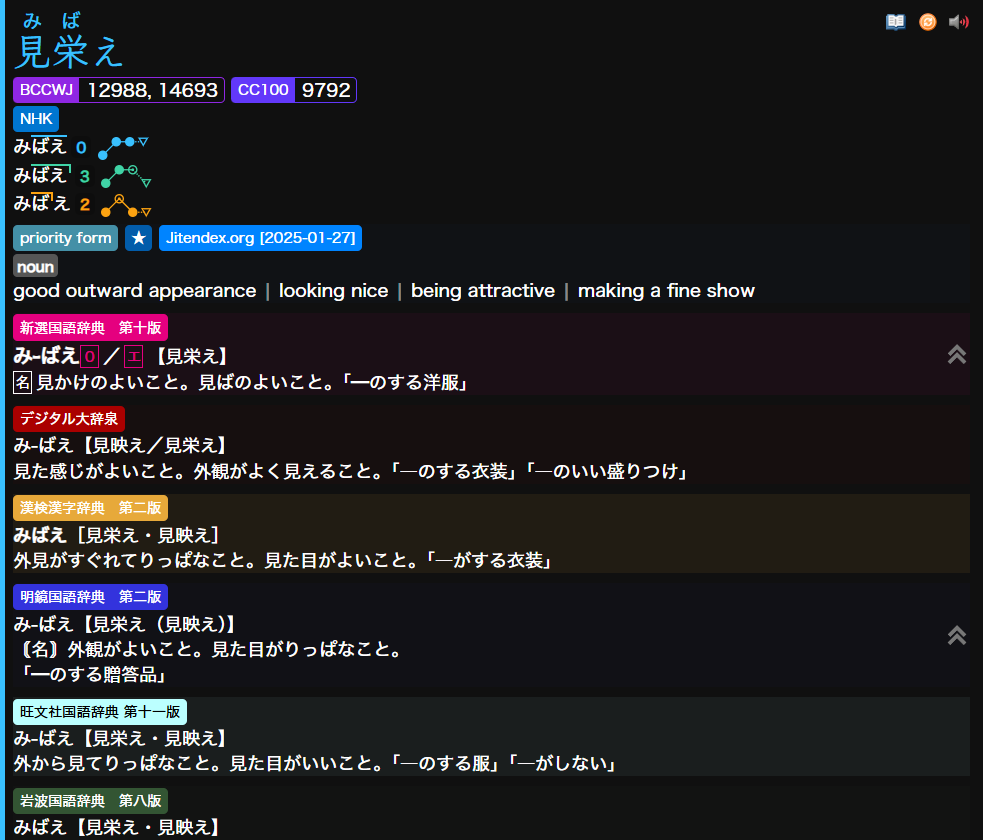

# Setup: Yomitan

Configure Yomitan to automatically populate Senren's fields when creating cards.

## Fields Configuration

In Yomitan Settings -> Anki -> Configure Anki Flashcards:

| Field                 | Value                                                                       | Note         |
|-----------------------|-----------------------------------------------------------------------------|--------------|
|  word                 | `{expression}`                                                              |              |
|  reading              | `{reading}`                                                                 |              |
|  sentence             | `<span class="group">{cloze-prefix}<span class="highlight">{cloze-body}</span>{cloze-suffix}</span>`   |  `{cloze-prefix}<b>{cloze-body}</b>{cloze-suffix}` or `{cloze-prefix}<span class="highlight">{cloze-body}</span>{cloze-suffix}` will also work if you don’t intend to use the scene switching feature. Both the `<b>` tag and the `<span class="highlight">` are supported for marking the target word. ||
|  sentenceFurigana     | `<span class="group">{sentence-furigana}</span>`                           | Alternatively, use `<span class="group">{sentence-furigana-plain}</span>`. As with `sentence`, you can remove the outer `<span>` if you don’t intend to use the scene switching feature. |
|  sentenceTranslation  |                                                                             | Leave empty. |
|  sentenceCard         |                                                                             | Leave empty. |
|  audioCard            |                                                                             | Leave empty. |
|  notes                |                                                                             | Leave empty. | 
|  selectionText        | `{popup-selection-text}`                                                    | The selected text from the search page or popup takes priority over the dictionary in the `definition` field. If no text is selected, it doesn't do anything.               |
|  definition           | `{single-glossary-jitendexorg-2026-01-04}`                                  | Set your primary dictionary here, or leave it empty. The primary dictionary can be set in the `dictionaryPreference` field. |
|  wordAudio            | `{audio}`                                                                   |              |
|  sentenceAudio        |                                                                             | Leave empty. |
|  picture              | `{clipboard-image}`                                                         |              |
|  glossary             | `{glossary}`                                                                | There are two ways to use this field. The first is by setting it to `{glossary}`, this will extract definitions from all your dictionaries. <br> The second is by setting it to specific dictionaries (e.g. `{single-glossary-新選国語辞典-第十版}{single-glossary-デジタル大辞泉}{single-glossary-漢検漢字辞典-第二版}`), which will include only the selected ones. <br><br> This requires "Group term-reading pairs" or "Group related terms" to be enabled in Result Display [(see below)](#result-display-setting). |
|  pitchAccents         | `{pitch-accents}`                                                           | Requires pitch accent dictionaries. |
|  pitchPositions       | `{pitch-accent-positions}`                                                  | Requires pitch accent dictionaries. |
|  pitchCategories      | `{pitch-accent-categories}`                                                 | Requires pitch accent dictionaries. |
|  frequencies          | `{frequencies}`                                                             | Requires frequency dictionaries. |
|  freqSort             | `{frequency-harmonic-rank}`                                                 | Used for sorting new cards. Requires frequency dictionaries. |
|  miscInfo             | `{document-title}`                                                          | Captures the source web page title. Leave empty if using mpvacious or similar tools that populate this. |
|  dictionaryPreference |                                                                             | Enter `glossary` to show the glossary first, leave it empty to show the `definition` first, or enter a dictionary name to prioritize it (e.g., `新選国語辞典　第十版`). If Jitendex is your main dictionary but you want another one for a specific card, edit this field in **Anki** and it will take priority without using Selection Text. <br><br> Use [Batch Editing add-on](https://ankiweb.net/shared/info/291119185) to update existing cards. |

## Result Display Setting

Crucially, for the `glossary` field to work correctly with multiple dictionaries listed, you need to enable grouping in Yomitan:

Go to **Yomitan Settings** -> **Appearance** -> **Result Display** and select either:

*   **Group term-reading pairs** OR
*   **Group related terms**


## CSS Template (Optional) 

* Go to Yomitan Settings -> Appearance -> Configure Custom CSS...
* Select all existing content in the template editor.
* Replace it with the following code:

??? note "Click to expand CSS code"

    ```css
    /* Firefox specific fix for furigana alignment (Remove this rule if not using Firefox) */
    .headword ruby>* {
      margin-top: -3px;
      margin-bottom: -10px;
    }

    :root[data-theme="light"] {
      --background-color: #f5f5f5;
      --dict-color-opacity: 100%;
      --dict-color: var(--tag-dictionary-background-color);
      --dict-bg-opacity: 0;
      --example-keyword: #E20033;
      --tag-text-color: white;
      --tag-border-color: transparent;
      --tag-default-background-color: rgba(0, 0, 0, 0.08);
      --tag-name-background-color: #88C0D0;
      --tag-expression-background-color: #88C0D0;
      --tag-archaism-background-color: #88C0D0;
      --tag-dictionary-background-color: #8FBCBB;
      --tag-frequency-background-color: #81A1C1;
      --tag-part-of-speech-background-color: #88C0D0;
      --tag-search-background-color: #88C0D0;
      --tag-pitch-accent-dictionary-background-color: #5E81AC;
      --jitendex-separators: rgba(105, 105, 105, 0.3);
      --text-color: #2e3440;
      --pitch-accent-annotation-color: #4c566a;
      --reason-text-color: #5E81AC;
      --notification-text-color: #2e3440;
      --notification-background-color: #e5e9f0;
      --progress-bar-track-color: #4c566a;
      --sidebar-background-color: #eceff4;
      --sidebar-button-background-color: transparent;
      --sidebar-button-background-color-hover: #d8dee9;
      --sidebar-button-background-color-active: #c8ced9;
      --sidebar-button-danger-background-color: transparent;
      --sidebar-button-danger-background-color-hover: #bf616a;
      --sidebar-button-danger-background-color-active: #a54f58;
      --sidebar-button-icon-color: #4c566a;
      --sidebar-button-disabled-icon-color: #abb2bf;
      --sidebar-button-danger-icon-color: #4c566a;
      --list-padding1: 0;

      /* Marked Mora */
      --devoiced-color: RoyalBlue;
      --nasal-color: #d03e2d;

      /* Pitch Accent Colors (Slightly darkened for light mode legibility) */
      --pitch-red: #D62839;
      --pitch-blue: #3474FF;
      --pitch-orange: #FF6E03;
      --pitch-green: #2BAF7E;
      --pitch-purple: #8A5EDE;
      --pitch-background: rgba(255, 255, 255, 0.8);

      /* Fonts */
      --font-sans: "Hiragino Kaku Gothic ProN", sans-serif;
      --font-serif: "Klee One", serif;
    }

    :root[data-theme="dark"] {
      --background-color: #101010;
      --dict-color-opacity: 100%;
      --dict-color: var(--tag-dictionary-background-color);
      --dict-bg-opacity: 0;
      --example-keyword: #FCFF61;
      --tag-text-color: white;
      --tag-border-color: transparent;
      --tag-default-background-color: rgba(0, 0, 0, 0.4);
      --tag-name-background-color: #88C0D0;
      --tag-expression-background-color: #88C0D0;
      --tag-archaism-background-color: #88C0D0;
      --tag-dictionary-background-color: #8FBCBB;
      --tag-frequency-background-color: #81A1C1;
      --tag-part-of-speech-background-color: #88C0D0;
      --tag-search-background-color: #88C0D0;
      --tag-pitch-accent-dictionary-background-color: #5E81AC;
      --jitendex-separators: rgba(255, 255, 255, 0.5);
      --text-color: white;
      --pitch-accent-annotation-color: #ebffff;
      --reason-text-color: #5E81AC;
      --notification-text-color: #ebffff;
      --notification-background-color: #3B4252;
      --progress-bar-track-color: #D8DEE9;
      --sidebar-background-color: #2E3440;
      --sidebar-button-background-color: transparent;
      --sidebar-button-background-color-hover: #81A1C1;
      --sidebar-button-background-color-active: #6d88a3;
      --sidebar-button-danger-background-color: transparent;
      --sidebar-button-danger-background-color-hover: #BF616A;
      --sidebar-button-danger-background-color-active: #8a373f;
      --sidebar-button-icon-color: #ebffff;
      --sidebar-button-disabled-icon-color: #808c8c;
      --sidebar-button-danger-icon-color: #ebffff;
      --list-padding1: 0;

      /* Marked Mora */
      --devoiced-color: cornflowerBlue;
      --nasal-color: #FF4936;

      /* Pitch Accent Colors */
      --pitch-red: #F5436D;
      --pitch-blue: #39C1FF;
      --pitch-orange: #fca311;
      --pitch-green: #40D4A6;
      --pitch-purple: #afa2ff;
      --pitch-background: rgba(0, 0, 0, 0.2);

      /* Fonts */
      --font-sans: hiragino kaku gothic proN;
      --font-serif: klee one;
    }

    /* Base Settings */
    body {
      font-family: var(--font-sans);
      line-height: 1.4;
    }

    .content-body {
      font-size: 18px;
    }

    .headword {
      font-family: var(--font-serif);
      font-size: 1.2rem;
      font-weight: bold;
    }

    .headword-kanji-link {
      text-decoration: none;
    }

    .source-text rt {
      font-family: var(--font-sans);
      font-weight: normal;
    }

    ul,
    ol,
    li {
      list-style: none !important;
    }

    ul,
    ol {
      display: inline;
    }

    .definition-list {
      padding: 0;
    }

    .toggle>input[type=checkbox]:checked+.toggle-body>.toggle-track {
      background: var(--toggle-track-color);
    }

    rt.query-parser-segment-reading {
      display: none;
    }

    .entry-body-section-content.pronunciation-group-list {
      display: grid;
      grid-gap: 5px;
      margin-bottom: 5px;
    }

    .definition-item {
      margin-bottom: 10px;
    }

    .gloss-content structured-content {
      margin: 0;
    }

    #search-textbox {
      font-size: initial;
    }

    /* Inflections Hover */
    .inflection-rule-chains {
      display: inline-block;
      position: relative;
    }

    .inflection-source-icon,
    .inflection-rule-chains:not(:empty) li {
      display: none;
    }

    .inflection-rule-chains:not(:empty)::before {
      content: '🅸';
      cursor: help;
      color: gray;
    }

    .inflection-rule-chains:not(:empty):hover li {
      display: block;
    }

    .inflection-rule-chain:nth-last-of-type(1) {
      margin-bottom: 0.2em;
    }

    /* Dictionary Colorizer */
    .definition-item {
      background-color: color-mix(in srgb,
          var(--dict-color) calc(var(--dict-bg-opacity) * var(--dict-color-opacity)),
          var(--background-color));
      --tag-dictionary-background-color: var(--dict-color);
    }

    .definition-item[data-dictionary^="旺文社国語辞典"] {
      --dict-color: rgb(187, 255, 255);
      --dict-bg-opacity: 0.06;
      --tag-text-color: black;
    }

    .definition-item[data-dictionary^="明鏡国語辞典"] {
      --dict-color: rgb(51, 51, 221);
      --dict-bg-opacity: 0.03;
    }

    .definition-item[data-dictionary^="岩波国語辞"] {
      --dict-color: rgb(51, 85, 51);
      --dict-bg-opacity: 0.05;
    }

    .definition-item[data-dictionary*="新明解"] {
      --dict-color: rgb(255, 0, 0);
      --dict-bg-opacity: 0.025;
    }

    .definition-item[data-dictionary^="大辞林"] {
      --dict-color: rgb(85, 34, 85);
      --dict-bg-opacity: 0.03;
    }

    .definition-item[data-dictionary="デジタル大辞泉"] {
      --dict-color: rgb(170, 0, 0);
      --dict-bg-opacity: 0.04;
    }

    .definition-item[data-dictionary="大辞泉 第二版"] {
      --dict-color: rgb(170, 0, 0);
      --dict-bg-opacity: 0.04;
    }

    .definition-item[data-dictionary*="小学館例解学習国語"] {
      --dict-color: rgb(77, 208, 225);
      --dict-bg-opacity: 0.04;
    }

    .definition-item[data-dictionary="精選版　日本国語大辞典"] {
      --dict-color: rgb(238, 238, 204);
      --dict-bg-opacity: 0.05;
      --tag-text-color: black;
    }

    .definition-item[data-dictionary="ハイブリッド新辞林"] {
      --dict-color: rgb(221, 221, 238);
      --dict-bg-opacity: 0.15;
      --tag-text-color: black;
    }

    .definition-item[data-dictionary^="広辞苑"] {
      --dict-color: rgb(51, 51, 51);
      --dict-bg-opacity: 0.05;
    }

    .definition-item[data-dictionary$="辞典オンライン"],
    .definition-item[data-dictionary="故事・ことわざ・慣用句オンライン"] {
      --dict-color: rgb(255, 227, 124);
      --dict-bg-opacity: 0.05;
      --tag-text-color: black;
    }

    .definition-item[data-dictionary="実用日本語表現辞典"] {
      --dict-color: rgb(99, 108, 141);
      --dict-bg-opacity: 0.05;
    }

    .definition-item[data-dictionary^="三省堂国語辞典"] {
      --dict-color: rgb(229, 107, 57);
      --dict-bg-opacity: 0.03;
    }

    .definition-item[data-dictionary^="JMdict"],
    .definition-item[data-dictionary^="JMDict"],
    .definition-item[data-dictionary^="JMnedict"],
    .definition-item[data-dictionary^="Jitendex"] {
      --dict-color: rgb(0, 132, 255);
      --dict-bg-opacity: 0.02;
    }

    .definition-item[data-dictionary="NEW斎藤和英大辞典"] {
      --dict-color: rgb(244, 225, 254);
      --dict-bg-opacity: 0.15;
      --tag-text-color: black;
    }

    .definition-item[data-dictionary="新和英"] {
      --dict-color: rgb(21, 70, 51);
      --dict-bg-opacity: 0.03;
    }

    .definition-item[data-dictionary^="Pixiv"] {
      --dict-color: rgb(0, 151, 250);
      --dict-bg-opacity: 0.03;
    }

    .definition-item[data-dictionary="漢字源"] {
      --dict-color: rgb(201, 149, 93);
      --dict-bg-opacity: 0.05;
    }

    .definition-item[data-dictionary="日本語俗語辞書"] {
      --dict-color: rgb(176, 4, 157);
      --dict-bg-opacity: 0.05;
    }

    .definition-item[data-dictionary="weblio古語辞典"] {
      --dict-color: rgb(193, 123, 148);
      --dict-bg-opacity: 0.05;
    }

    .definition-item[data-dictionary="語源由来辞典"] {
      --dict-color: rgb(206, 169, 47);
      --dict-bg-opacity: 0.05;
    }

    .definition-item[data-dictionary="学研 四字熟語辞典"] {
      --dict-color: rgb(180, 192, 152);
      --dict-bg-opacity: 0.08;
      --tag-text-color: black;
    }

    .definition-item[data-dictionary="故事ことわざの辞典"] {
      --dict-color: rgb(117, 87, 85);
      --dict-bg-opacity: 0.05;
    }

    .definition-item[data-dictionary^="日本語文法辞典"] {
      --dict-color: rgb(23, 59, 173);
      --dict-bg-opacity: 0.05;
    }

    .definition-item[data-dictionary="絵でわかる日本語"] {
      --dict-color: rgb(207, 76, 110);
      --dict-bg-opacity: 0.05;
    }

    .definition-item[data-dictionary="JLPT文法解説まとめ"] {
      --dict-color: rgb(244, 66, 54);
      --dict-bg-opacity: 0.05;
    }

    .definition-item[data-dictionary="どんなときどう使う 日本語表現文型辞典"] {
      --dict-color: rgb(126, 168, 232);
      --dict-bg-opacity: 0.08;
    }

    .definition-item[data-dictionary="毎日のんびり日本語教師"] {
      --dict-color: rgb(255, 216, 228);
      --dict-bg-opacity: 0.12;
      --tag-text-color: black;
    }

    .definition-item[data-dictionary^="新選国語辞典　第十版"] {
      --dict-color: #E5007F !important;
      --dict-bg-opacity: 0.05;
    }

    .definition-item[data-dictionary="使い方の分かる 類語例解辞典"],
    .definition-item[data-dictionary="全国方言辞典"] {
      --dict-color: #9c4836;
      --dict-bg-opacity: 0.03;
    }

    .definition-item[data-dictionary="新語時事用語辞典"] {
      --dict-color: #6e9ac6;
      --dict-bg-opacity: 0.07;
    }

    .definition-item[data-dictionary="漢字ペディア同訓異義"] {
      --dict-color: #b7b7b7;
      --dict-bg-opacity: 0.12;
    }

    .definition-item[data-dictionary*="Wikipedia"] {
      --dict-color: #447ff5;
      --dict-bg-opacity: 0.03;
    }

    .definition-item[data-dictionary^="漢検漢字辞典"] {
      --dict-color: #e7a93a;
      --dict-bg-opacity: 0.08;
    }

    .definition-item[data-dictionary^="例解学習国語辞典"] {
      --dict-color: #faa72f;
      --dict-bg-opacity: 0.05;
    }

    .definition-item[data-dictionary^="現代国語例解辞典"] {
      --dict-color: #e3323a;
      --dict-bg-opacity: 0.04;
    }

    .tag[data-category="dictionary"][data-details="漢字辞典オンライン"] {
      --tag-color: rgb(255, 227, 124);
      --tag-text-color: black;
    }

    .tag[data-category="dictionary"][data-details="JPDB Kanji"] {
      --tag-color: #ff3e3d;
    }

    .tag[data-category="dictionary"][data-details="TheKanjiMap Kanji Radicals/Composition"] {
      --tag-color: #2a94c9;
    }

    .tag[data-category="dictionary"][data-details*="Wiktionary"] {
      --tag-color: #447ff5;
    }

    .tag[data-category="dictionary"][data-details^="KANJIDIC"] {
      --tag-color: rgb(0, 132, 255);
    }

    /* Pitch Accent */
    .tag[data-category="pronunciation-dictionary"][data-details="NHK"] {
      --tag-color: #0076d0;
    }

    .tag[data-category="pronunciation-dictionary"][data-details^="大辞泉"] {
      --tag-color: rgb(170, 0, 0);
    }

    .tag[data-category="pronunciation-dictionary"][data-details^="大辞林"] {
      --tag-color: rgb(85, 34, 85);
    }

    /* Frequency Dicts (Also Kanji Dicts) */
    .frequency-group-item[data-details^="JPDB"] {
      --tag-frequency-background-color: #ff3e3d;
    }

    .frequency-group-item[data-details^="Innocent"] {
      --tag-frequency-background-color: #e82c9c;
    }

    .frequency-group-item[data-details="Novels"] {
      --tag-frequency-background-color: #e537fa;
    }

    .frequency-group-item[data-details^="BCCWJ"] {
      --tag-frequency-background-color: #8f27e3;
    }

    .frequency-group-item[data-details="CC100"] {
      --tag-frequency-background-color: #6238fa;
    }

    .frequency-group-item[data-details="Conversation Corpus"] {
      --tag-frequency-background-color: #273ce3;
    }

    .frequency-group-item[data-details^="青空文庫"] {
      --tag-frequency-background-color: #3d93ff;
    }

    .frequency-group-item[data-details="Youtube"] {
      --tag-frequency-background-color: #fd0101;
    }

    .frequency-group-item[data-details^="Wikipedia"] {
      --tag-frequency-background-color: #447ff5;
    }

    .frequency-group-item[data-details^="Jiten"] {
      --tag-frequency-background-color: #2e2e8e;
    }

    /* Frequency hover (average enabled) */
    [data-average-frequency="true"] [data-section-type="frequencies"]:active .frequency-group-item:not([data-details="Average"]) {
      display: inline-block;
    }

    [data-average-frequency="true"] [data-section-type="frequencies"]:active .frequency-group-item[data-details="Average"] {
      display: none;
    }

    /* Frequency hover (average disabled) */
    [data-average-frequency="false"] span.frequency-group-item:nth-child(n + 4) {
      display: none;
    }

    [data-average-frequency="false"] [data-section-type="frequencies"]:active span.frequency-group-item:nth-child(n + 4):not([data-details="Average"]) {
      display: inline-block;
    }

    /* Pitch Accent Hover */
    li.pronunciation-group:first-child~* {
      display: none;
    }

    ol.pronunciation-group-list:active li.pronunciation-group:first-child~li.pronunciation-group {
      display: inline-block;
    }


    /* Hide add duplicate */
    button.action-button[title="Add duplicate expression (Alt + E)"] {
      display: none;
    }

    /* Hide add reading */
    button.action-button[title="Add reading (Alt + R)"] {
      display: none;
    }

    /* Hide tags */
    [data-category="popular"],
    [data-category="frequent"] {
      display: none;
    }

    /* Only show summary for Pixiv */
    [data-sc-pixiv="children"],
    [data-sc-pixiv="related-tags"],
    [data-sc-pixiv="continue-reading"],
    [data-sc-pixiv="nav-header"] {
      display: none;
    }

    /* Jitendex Settings */
    [data-glossary-layout-mode="default"] [data-sc-content="glossary"] li:not(:last-child)::after {
      color: var(--jitendex-separators) !important;
    }

    [data-dictionary*="Jitendex.org"] {

      li[data-sc-content="sense-group"],
      li[data-sc-content="forms"],
      li[data-sc-content="sense"],
      ul[data-sc-content="glossary"] {
        padding-left: 0 !important;
      }
    }

    [data-dictionary*="Jitendex.org"] {
      span[data-sc-class="tag"] {
        margin-right: 0.25em !important;
      }
    }

    .definition-item[data-dictionary*="Jitendex"] *[data-sc-content="example-sentence-a"] {
      font-size: 1em !important;
    }

    [data-glossary-layout-mode="default"] [data-sc-content="glossary"] {
      display: flex;
      flex-wrap: wrap;
      padding: 0;
      margin: 0;
    }

    [data-glossary-layout-mode="default"] [data-sc-content="glossary"] li:not(:last-child)::after {
      content: "|";
      color: rgba(255, 255, 255, 0.5);
      margin: 0 8px;
    }

    /* Hide version date */
    .tag[title^="Jitendex"] .tag-label-content {
      font-size: 0;
    }

    .tag[title^="Jitendex"] .tag-label-content::after {
      content: "Jitendex";
      font-size: 0.885rem;
    }

    /* Example Keyword */
    span[data-sc-content="example-keyword"] {
      color: var(--example-keyword) !important;
      text-decoration: none !important;
    }

    /* Example Sentences */
    [data-sc-content|="example-sentence"] {
      opacity: 0.5;
      display: block;
      transition: opacity 0.3s ease;
    }

    [data-sc-content|="example-sentence"]:hover {
      opacity: 1;
      display: block;
    }

    [data-sc-content="example-sentence-a"] {
      transition: opacity 0.3s ease;
    }

    [data-sc-content="example-sentence-b"] {
      opacity: 0;
      display: none;
      transition: opacity 0.3s ease;
      /* Collapse height initially */
      overflow: hidden;
      /* Hide overflow */
    }

    [data-sc-content="example-sentence-a"]:hover+[data-sc-content="example-sentence-b"] {
      opacity: 1;
      display: block;
    }

    [data-sc-content="example-sentence-b"]:hover [data-sc-content|="example-sentence"] {
      opacity: 1;
    }

    [data-sc-content="example-sentence"] rt {
      opacity: 0;
      transition: opacity ease 0.3s;
    }

    [data-sc-content="example-sentence"]:hover rt {
      opacity: 1;
    }

    /* Hidden */
    [data-sc-content="forms"] {
      display: none;
    }

    div[data-sc-content="attribution"] {
      display: none;
    }

    /* Extra */
    [data-sc-content="antonym"],
    [data-sc-content="sense-note"],
    [data-sc-content="xref"] {
      opacity: 0.5;
      transition: opacity 0.3s ease;
    }

    [data-sc-content="antonym"]:hover,
    [data-sc-content="sense-note"]:hover,
    [data-sc-content="xref"]:hover {
      opacity: 1;
    }

    /* Pitch Accent Colors */
    .pronunciation-mora-line {
      border-top-width: 0.15em !important;
      border-right-width: 0.15em !important;
    }

    /* Heiban*/
    html:has(.entry-current .headword[data-is-primary="true"][data-pronunciation-categories^="heiban"]) {
      --accent-color: var(--pitch-blue);
    }

    .headword[data-pronunciation-categories^="heiban"],
    .headword[data-pronunciation-categories^="heiban"] rt {
      --headword-text-color: var(--pitch-blue);
      --headword-current-kanji-border-color: var(--pitch-blue);
      --headword-current-kanji-text-color: var(--pitch-blue);
      color: var(--pitch-blue);
    }

    .pronunciation:has(.pronunciation-downstep-notation[data-downstep-position="0"]) {
      --pronunciation-annotation-color: var(--pitch-blue);

      & .pronunciation-downstep-notation-number {
        color: var(--pitch-blue);
      }
    }

    /* Atamadaka */
    html:has(.entry-current .headword[data-is-primary="true"][data-pronunciation-categories^="atamadaka"]) {
      --accent-color: var(--pitch-red);
    }

    .headword[data-pronunciation-categories^="atamadaka"],
    .headword[data-pronunciation-categories^="atamadaka"] rt {
      --headword-text-color: var(--pitch-red);
      --headword-current-kanji-border-color: var(--pitch-red);
      --headword-current-kanji-text-color: var(--pitch-red);
      color: var(--pitch-red);
    }

    .pronunciation:has(.pronunciation-downstep-notation[data-downstep-position="1"]) {
      --pronunciation-annotation-color: var(--pitch-red);

      & .pronunciation-downstep-notation-number {
        color: var(--pitch-red);
      }
    }

    /* Nakadaka */
    html:has(.entry-current .headword[data-is-primary="true"][data-pronunciation-categories^="nakadaka"]) {
      --accent-color: var(--pitch-orange);
    }

    .headword[data-pronunciation-categories^="nakadaka"],
    .headword[data-pronunciation-categories^="nakadaka"] rt {
      --headword-text-color: var(--pitch-orange);
      --headword-current-kanji-border-color: var(--pitch-orange);
      --headword-current-kanji-text-color: var(--pitch-orange);
      color: var(--pitch-orange);
    }

    .pronunciation {
      &:has(.pronunciation-mora:not(:last-child)[data-pitch-next="low"]):has(.pronunciation-downstep-notation:not([data-downstep-position="1"])) {
        --pronunciation-annotation-color: var(--pitch-orange) !important;

        & .pronunciation-downstep-notation-number {
          color: var(--pitch-orange) !important;
        }
      }
    }

    /* Odaka */
    html:has(.entry-current .headword[data-is-primary="true"][data-pronunciation-categories^="odaka"]) {
      --accent-color: var(--pitch-green);
    }

    .headword[data-pronunciation-categories^="odaka"],
    .headword[data-pronunciation-categories^="odaka"] rt {
      --headword-text-color: var(--pitch-green);
      --headword-current-kanji-border-color: var(--pitch-green);
      --headword-current-kanji-text-color: var(--pitch-green);
      color: var(--pitch-green);
    }

    .pronunciation {
      &:has(.pronunciation-mora:last-child[data-pitch-next="low"]):not(:has(.pronunciation-downstep-notation[data-downstep-position="1"])) {
        --pronunciation-annotation-color: var(--pitch-green);

        & .pronunciation-downstep-notation-number {
          color: var(--pitch-green);
        }
      }
    }

    /* Kifuku */
    html:has(.entry-current .headword[data-is-primary="true"][data-pronunciation-categories^="kifuku"]) {
      --accent-color: var(--pitch-purple);
    }

    .headword[data-pronunciation-categories^="kifuku"],
    .headword[data-pronunciation-categories^="kifuku"] rt {
      --headword-text-color: var(--pitch-purple);
      --headword-current-kanji-border-color: var(--pitch-purple);
      --headword-current-kanji-text-color: var(--pitch-purple);
      color: var(--pitch-purple);
    }

    /* Downstep Position */
    .pronunciation-downstep-notation-number {
      font-weight: bold;
      font-family: var(--font-sans);
      padding: 2px 5px 2px 5px;
      border-radius: 5px;
      background: var(--pitch-background);
      font-size: 0.8em;
      text-align: center;
    }

    .pronunciation-downstep-notation-prefix,
    .pronunciation-downstep-notation-suffix {
      display: none;
    }

    /* Nasal Mora */
    .pronunciation-nasal-indicator {
      border: 0.1em solid var(--nasal-color);
      width: 0.35em;
      height: 0.35em;
      right: -0.1em;
      top: 0.225em;
    }

    /* Devoiced Mora */
    .pronunciation-devoice-indicator {
      display: none;
    }

    .pronunciation-mora[data-devoice="true"] {
      color: var(--devoiced-color);
    }

    /* Format Buttons */
    .action-button-container~.action-button-container .action-button[data-action="view-note"] {
      display: none;
    }

    .action-button-container[data-card-format-index="1"] .action-icon[data-icon="overwrite-big-circle"] {
      filter: hue-rotate(180deg);
    }

    /* Hide Tag List */
    .headword-list-tag-list.tag-list {
      display: none !important;
    }
    ```
    


## Alternative CSS Template (Optional) 

* Go to Yomitan Settings -> Appearance -> Configure Custom CSS...
* Select all existing content in the Popup CSS template editor.
* Replace it with the following code:

??? note "Click to expand Popup CSS Code"

    ```css
    /* Firefox specific fix for furigana alignment (Remove this rule if not using Firefox) */
    .headword ruby>* {
      margin-top: -3px;
      margin-bottom: -10px;
    }

    /* General settings */
    :root {
      --entry-vertical-padding: 0.5em;
      --entry-horizontal-padding: 0.5em;
      --line-height-no-units: 16;
      --sidebar-button-height-no-units: 10;
      --sidebar-button-icon-size-no-units: 10;
      --collapsible-definition-line-count: 15;
    }

    /* Fix search page width */
    :root[data-page-type="search"] {
      --content-width: 1400px;
    }

    :root[data-theme="light"] {
      --background-color: transparent;
      --dict-color-opacity: 100%;
      --dict-color: var(--tag-dictionary-background-color);
      --dict-bg-opacity: 0.03;
      --example-keyword: #E20033;
      --tag-text-color: white;
      --tag-border-color: transparent;
      --tag-default-background-color: rgba(0, 0, 0, 0.08);
      --tag-name-background-color: #88C0D0;
      --tag-expression-background-color: #88C0D0;
      --tag-archaism-background-color: #88C0D0;
      --tag-dictionary-background-color: #8FBCBB;
      --tag-frequency-background-color: #81A1C1;
      --tag-part-of-speech-background-color: #88C0D0;
      --tag-search-background-color: #88C0D0;
      --tag-pitch-accent-dictionary-background-color: #5E81AC;
      --jitendex-separators: rgba(105, 105, 105, 0.3);
      --text-color: #2e3440;
      --pitch-accent-annotation-color: #4c566a;
      --reason-text-color: #5E81AC;
      --notification-text-color: #2e3440;
      --notification-background-color: #e5e9f0;
      --progress-bar-track-color: #4c566a;
      --sidebar-background-color: #eceff4;
      --sidebar-button-background-color: transparent;
      --sidebar-button-background-color-hover: #d8dee9;
      --sidebar-button-background-color-active: #c8ced9;
      --sidebar-button-danger-background-color: transparent;
      --sidebar-button-danger-background-color-hover: #bf616a;
      --sidebar-button-danger-background-color-active: #a54f58;
      --sidebar-button-icon-color: #4c566a;
      --sidebar-button-disabled-icon-color: #abb2bf;
      --sidebar-button-danger-icon-color: #4c566a;
      --list-padding1: 0;

      /* Marked Mora */
      --devoiced-color: RoyalBlue;
      --nasal-color: #d03e2d;

      /* Pitch Accent Colors (Slightly darkened for light mode legibility) */
      --pitch-red: #D62839;
      --pitch-blue: #3474FF;
      --pitch-orange: #FF6E03;
      --pitch-green: #2BAF7E;
      --pitch-purple: #8A5EDE;
      --pitch-background: rgba(255, 255, 255, 0.4);

      /* Fonts */
      --font-sans: "Hiragino Kaku Gothic ProN", sans-serif;
      --font-serif: "Klee One", serif;
    }

    :root[data-theme="dark"] {
      --background-color: transparent;
      --dict-color-opacity: 100%;
      --dict-color: var(--tag-dictionary-background-color);
      --dict-bg-opacity: 0.03;
      --example-keyword: #FCFF61;
      --tag-text-color: white;
      --tag-border-color: transparent;
      --tag-default-background-color: rgba(0, 0, 0, 0.4);
      --tag-name-background-color: #88C0D0;
      --tag-expression-background-color: #88C0D0;
      --tag-archaism-background-color: #88C0D0;
      --tag-dictionary-background-color: #8FBCBB;
      --tag-frequency-background-color: #81A1C1;
      --tag-part-of-speech-background-color: #88C0D0;
      --tag-search-background-color: #88C0D0;
      --tag-pitch-accent-dictionary-background-color: #5E81AC;
      --jitendex-separators: rgba(255, 255, 255, 0.5);
      --text-color: white;
      --pitch-accent-annotation-color: #ebffff;
      --reason-text-color: #5E81AC;
      --notification-text-color: #ebffff;
      --notification-background-color: #3B4252;
      --progress-bar-track-color: #D8DEE9;
      --sidebar-background-color: #2E3440;
      --sidebar-button-background-color: transparent;
      --sidebar-button-background-color-hover: #81A1C1;
      --sidebar-button-background-color-active: #6d88a3;
      --sidebar-button-danger-background-color: transparent;
      --sidebar-button-danger-background-color-hover: #BF616A;
      --sidebar-button-danger-background-color-active: #8a373f;
      --sidebar-button-icon-color: #ebffff;
      --sidebar-button-disabled-icon-color: #808c8c;
      --sidebar-button-danger-icon-color: #ebffff;
      --list-padding1: 0;

      /* Marked Mora */
      --devoiced-color: cornflowerBlue;
      --nasal-color: #FF4936;

      /* Pitch Accent Colors */
      --pitch-red: #F5436D;
      --pitch-blue: #39C1FF;
      --pitch-orange: #fca311;
      --pitch-green: #40D4A6;
      --pitch-purple: #afa2ff;
      --pitch-background: rgba(0, 0, 0, 0.2);

      /* Fonts */
      --font-sans: "Hiragino Kaku Gothic ProN", sans-serif;
      --font-serif: "Klee One", serif;
    }

    /* Tranparency Theme */
    :root[data-theme="light"] {
      color-scheme: light !important;
      /* Forces light theme */
      --text-color: #202020;
      --subtext-color: #535353;
    }

    :root[data-theme="dark"] {
      color-scheme: dark !important;
      /* Forces dark theme */
      --text-color: #F2F2F2;
      --subtext-color: #acacac;
    }

    body {
      background: transparent !important;
    }

    /* glossary */
    .gloss-sc-thead,
    .gloss-sc-tfoot,
    .gloss-sc-th {
      background-color: transparent !important;
    }

    /* Hide scrollbars but keep scrolling functional */
    .scrollbar {
      scrollbar-color: transparent transparent !important;
      /* Firefox */
      scrollbar-width: none !important;
      /* Firefox */
    }

    .scrollbar::-webkit-scrollbar {
      display: none !important;
      /* Chrome, Edge, Safari */
    }

    /* Base Typography & Layout */
    body {
      font-family: var(--font-sans);
      line-height: 1.4;
    }

    .content-body {
      font-size: 18px;
    }

    .headword {
      font-family: var(--font-serif);
      font-size: 1.2rem;
      font-weight: bold;
    }

    .headword-kanji-link {
      text-decoration: none;
    }

    .headword-term ruby rt {
      user-select: none;
      /* Prevent selecting furigana */
    }

    .source-text rt {
      font-family: var(--font-sans);
      font-weight: normal;
    }

    ul,
    ol,
    li {
      list-style: none !important;
    }

    ul,
    ol {
      display: inline;
    }

    a {
      color: var(--dict-color);
    }

    /* Header & Search */
    #search-textbox {
      font-size: initial;
    }

    rt.query-parser-segment-reading {
      display: none;
    }

    /* Hide unused action buttons */
    button.action-button[title="Add duplicate expression (Alt + E)"],
    button.action-button[title="Add reading (Alt + R)"] {
      display: none;
    }

    /* Dictionary Entry Layout (Dual Pane) */
    .entry-body-section-content.pronunciation-group-list {
      display: grid;
      grid-gap: 5px;
      margin-bottom: 5px;
    }

    .definition-list {
      padding: 0;
      margin-top: 0.5em;
    }

    .entry-body-section-content.definition-list {
      display: grid;
      grid-template-columns: calc(50% - 0.25em) calc(50% - 0.25em);
      gap: 0.5em;
      margin: 0 auto 1em auto;
    }

    .entry-body-section-content.definition-list[data-count="1"] {
      grid-template-columns: 100%;
    }

    .entry-body-section-content.definition-list[data-count="1"] .definition-item {
      margin: 0 1em;
    }

    .definition-item {
      display: block;
      list-style-type: none;
      margin-bottom: 10px;
      padding: 0.8em;
      border-radius: 0.5em;
      box-shadow: 0 1px 0.6em rgba(0, 0, 0, 0.12), 0 1px 0.25em rgba(0, 0, 0, 0.24);
    }

    [data-theme="dark"] .definition-item {
      border: 0.1em solid rgba(0, 0, 0, 0.2);
      box-shadow: 0 1px 0.6em rgba(0, 0, 0, 0.22), 0 0.1em 0.25em rgba(0, 0, 0, 0.24);
    }

    .gloss-content structured-content {
      margin: 0;
    }

    .expansion-button {
      position: absolute;
      right: 0;
      height: calc(100% - 1.6em);
      width: 1.4em;
      align-items: center;
      z-index: 10;
    }

    .definition-item-inner.collapsible .definition-item-content {
      padding-right: 1em;
      box-sizing: border-box;
    }

    /* Pitch Accent Styling */
    .pronunciation-mora-line {
      border-top-width: 0.15em !important;
      border-right-width: 0.15em !important;
    }

    /* Pitch Accent: Show all pronunciations when pressed */
    li.pronunciation-group:first-child~* {
      display: none;
    }

    ol.pronunciation-group-list:active li.pronunciation-group:first-child~li.pronunciation-group {
      display: inline-block;
    }

    /* Downstep Position Number */
    .pronunciation-downstep-notation-number {
      font-weight: bold;
      font-family: var(--font-sans);
      padding: 2px 5px;
      border-radius: 5px;
      background: var(--pitch-background);
      font-size: 0.8em;
      text-align: center;
    }

    .pronunciation-downstep-notation-prefix,
    .pronunciation-downstep-notation-suffix {
      display: none;
    }

    /* Pitch Type Colors */
    /* Heiban */
    html:has(.entry-current .headword[data-is-primary="true"][data-pronunciation-categories^="heiban"]) {
      --accent-color: var(--pitch-blue);
    }

    .headword[data-pronunciation-categories^="heiban"],
    .headword[data-pronunciation-categories^="heiban"] rt {
      color: var(--pitch-blue);
      --headword-text-color: var(--pitch-blue);
      --headword-current-kanji-border-color: var(--pitch-blue);
      --headword-current-kanji-text-color: var(--pitch-blue);
    }

    .pronunciation:has(.pronunciation-downstep-notation[data-downstep-position="0"]) {
      --pronunciation-annotation-color: var(--pitch-blue);
    }

    .pronunciation:has(.pronunciation-downstep-notation[data-downstep-position="0"]) .pronunciation-downstep-notation-number {
      color: var(--pitch-blue);
    }

    /* Atamadaka */
    html:has(.entry-current .headword[data-is-primary="true"][data-pronunciation-categories^="atamadaka"]) {
      --accent-color: var(--pitch-red);
    }

    .headword[data-pronunciation-categories^="atamadaka"],
    .headword[data-pronunciation-categories^="atamadaka"] rt {
      color: var(--pitch-red);
      --headword-text-color: var(--pitch-red);
      --headword-current-kanji-border-color: var(--pitch-red);
      --headword-current-kanji-text-color: var(--pitch-red);
    }

    .pronunciation:has(.pronunciation-downstep-notation[data-downstep-position="1"]) {
      --pronunciation-annotation-color: var(--pitch-red);
    }

    .pronunciation:has(.pronunciation-downstep-notation[data-downstep-position="1"]) .pronunciation-downstep-notation-number {
      color: var(--pitch-red);
    }

    /* Nakadaka */
    html:has(.entry-current .headword[data-is-primary="true"][data-pronunciation-categories^="nakadaka"]) {
      --accent-color: var(--pitch-orange);
    }

    .headword[data-pronunciation-categories^="nakadaka"],
    .headword[data-pronunciation-categories^="nakadaka"] rt {
      color: var(--pitch-orange);
      --headword-text-color: var(--pitch-orange);
      --headword-current-kanji-border-color: var(--pitch-orange);
      --headword-current-kanji-text-color: var(--pitch-orange);
    }

    .pronunciation:has(.pronunciation-mora:not(:last-child)[data-pitch-next="low"]):has(.pronunciation-downstep-notation:not([data-downstep-position="1"])) {
      --pronunciation-annotation-color: var(--pitch-orange) !important;
    }

    .pronunciation:has(.pronunciation-mora:not(:last-child)[data-pitch-next="low"]):has(.pronunciation-downstep-notation:not([data-downstep-position="1"])) .pronunciation-downstep-notation-number {
      color: var(--pitch-orange) !important;
    }

    /* Odaka */
    html:has(.entry-current .headword[data-is-primary="true"][data-pronunciation-categories^="odaka"]) {
      --accent-color: var(--pitch-green);
    }

    .headword[data-pronunciation-categories^="odaka"],
    .headword[data-pronunciation-categories^="odaka"] rt {
      color: var(--pitch-green);
      --headword-text-color: var(--pitch-green);
      --headword-current-kanji-border-color: var(--pitch-green);
      --headword-current-kanji-text-color: var(--pitch-green);
    }

    .pronunciation:has(.pronunciation-mora:last-child[data-pitch-next="low"]):not(:has(.pronunciation-downstep-notation[data-downstep-position="1"])) {
      --pronunciation-annotation-color: var(--pitch-green);
    }

    .pronunciation:has(.pronunciation-mora:last-child[data-pitch-next="low"]):not(:has(.pronunciation-downstep-notation[data-downstep-position="1"])) .pronunciation-downstep-notation-number {
      color: var(--pitch-green);
    }

    /* Kifuku */
    html:has(.entry-current .headword[data-is-primary="true"][data-pronunciation-categories^="kifuku"]) {
      --accent-color: var(--pitch-purple);
    }

    .headword[data-pronunciation-categories^="kifuku"],
    .headword[data-pronunciation-categories^="kifuku"] rt {
      color: var(--pitch-purple);
      --headword-text-color: var(--pitch-purple);
      --headword-current-kanji-border-color: var(--pitch-purple);
      --headword-current-kanji-text-color: var(--pitch-purple);
    }

    /* Nasal Mora */
    .pronunciation-nasal-indicator {
      border: 0.1em solid var(--nasal-color);
      width: 0.35em;
      height: 0.35em;
      right: -0.1em;
      top: 0.225em;
    }

    /* Devoiced Mora */
    .pronunciation-devoice-indicator {
      display: none;
    }

    .pronunciation-mora[data-devoice="true"] {
      color: var(--devoiced-color);
    }

    /* Frequency Information */
    /* Frequency (average enabled): Show all frequencies when pressed */
    [data-average-frequency="true"] [data-section-type="frequencies"]:active .frequency-group-item:not([data-details="Average"]) {
      display: inline-block;
    }

    [data-average-frequency="true"] [data-section-type="frequencies"]:active .frequency-group-item[data-details="Average"] {
      display: none;
    }

    /* Frequency (average disabled): Show all frequencies when pressed */
    [data-average-frequency="false"] span.frequency-group-item:nth-child(n + 4) {
      display: none;
    }

    [data-average-frequency="false"] [data-section-type="frequencies"]:active span.frequency-group-item:nth-child(n + 4):not([data-details="Average"]) {
      display: inline-block;
    }

    /* Frequency Dictionary Colors */
    .frequency-group-item[data-details^="JPDB"] {
      --tag-frequency-background-color: #ff3e3d;
    }

    .frequency-group-item[data-details^="Innocent"] {
      --tag-frequency-background-color: #e82c9c;
    }

    .frequency-group-item[data-details="Novels"] {
      --tag-frequency-background-color: #e537fa;
    }

    .frequency-group-item[data-details^="BCCWJ"] {
      --tag-frequency-background-color: #8f27e3;
    }

    .frequency-group-item[data-details="CC100"] {
      --tag-frequency-background-color: #6238fa;
    }

    .frequency-group-item[data-details="Conversation Corpus"] {
      --tag-frequency-background-color: #273ce3;
    }

    .frequency-group-item[data-details^="青空文庫"] {
      --tag-frequency-background-color: #3d93ff;
    }

    .frequency-group-item[data-details="Youtube"] {
      --tag-frequency-background-color: #fd0101;
    }

    .frequency-group-item[data-details^="Wikipedia"] {
      --tag-frequency-background-color: #447ff5;
    }

    .frequency-group-item[data-details^="Jiten"] {
      --tag-frequency-background-color: #2e2e8e;
    }

    /* Inflections & Toggles */
    .toggle>input[type=checkbox]:checked+.toggle-body>.toggle-track {
      background: var(--toggle-track-color);
    }

    /* Inflections Hover */
    .inflection-rule-chains {
      display: inline-block;
      position: relative;
    }

    .inflection-source-icon,
    .inflection-rule-chains:not(:empty) li {
      display: none;
    }

    .inflection-rule-chains:not(:empty)::before {
      content: '🅸';
      cursor: help;
      color: gray;
    }

    .inflection-rule-chains:not(:empty):hover li {
      display: block;
    }

    .inflection-rule-chain:nth-last-of-type(1) {
      margin-bottom: 0.2em;
    }

    /* Hide popular/frequent tags */
    [data-category="popular"],
    [data-category="frequent"] {
      display: none;
    }

    /* Jitendex Settings */
    [data-glossary-layout-mode="default"] [data-sc-content="glossary"] li:not(:last-child)::after {
      color: var(--jitendex-separators) !important;
    }

    [data-dictionary*="Jitendex.org"] li[data-sc-content="sense-group"],
    [data-dictionary*="Jitendex.org"] li[data-sc-content="forms"],
    [data-dictionary*="Jitendex.org"] li[data-sc-content="sense"],
    [data-dictionary*="Jitendex.org"] ul[data-sc-content="glossary"] {
      padding-left: 0 !important;
    }

    [data-dictionary*="Jitendex.org"] span[data-sc-class="tag"] {
      margin-right: 0.25em !important;
    }

    .definition-item[data-dictionary*="Jitendex"] *[data-sc-content="example-sentence-a"] {
      font-size: 1em !important;
    }

    [data-glossary-layout-mode="default"] [data-sc-content="glossary"] {
      display: flex;
      flex-wrap: wrap;
      padding: 0;
      margin: 0;
    }

    [data-glossary-layout-mode="default"] [data-sc-content="glossary"] li:not(:last-child)::after {
      content: "|";
      color: rgba(255, 255, 255, 0.5);
      margin: 0 8px;
    }

    /* Jitendex Example Sentences & Keywords */
    span[data-sc-content="example-keyword"] {
      color: var(--example-keyword) !important;
      text-decoration: none !important;
    }

    [data-sc-content|="example-sentence"] {
      opacity: 0.5;
      display: block;
    }

    [data-dictionary*="Jitendex.org"] [data-sc-content|="example-sentence"]:hover {
      border-left-color: var(--dict-color);
    }

    [data-sc-content|="example-sentence"]:hover {
      opacity: 1;
      display: block;
    }

    [data-sc-content="example-sentence-a"] {
      transition: opacity 0.3s ease;
    }

    [data-sc-content="example-sentence-b"] {
      opacity: 0;
      display: none;
      transition: opacity 0.3s ease;
      overflow: hidden;
    }

    [data-sc-content="example-sentence-a"]:hover+[data-sc-content="example-sentence-b"] {
      opacity: 1;
      display: block;
    }

    [data-sc-content="example-sentence-b"]:hover [data-sc-content|="example-sentence"] {
      opacity: 1;
    }

    [data-sc-content="example-sentence"] rt {
      opacity: 0;
      transition: opacity ease 0.3s;
    }

    [data-sc-content="example-sentence"]:hover rt {
      opacity: 1;
    }

    /* Jitendex Hidden & Faded Elements */
    [data-sc-content="forms"],
    div[data-sc-content="attribution"] {
      display: none;
    }

    [data-sc-content="antonym"],
    [data-sc-content="sense-note"],
    [data-sc-content="xref"] {
      opacity: 0.5;
      transition: opacity 0.3s ease;
    }

    [data-sc-content="antonym"]:hover,
    [data-sc-content="sense-note"]:hover,
    [data-sc-content="xref"]:hover {
      opacity: 1;
    }

    /* Pixiv Settings */
    [data-sc-pixiv="children"],
    [data-sc-pixiv="related-tags"],
    [data-sc-pixiv="continue-reading"],
    [data-sc-pixiv="nav-header"] {
      display: none;
    }

    /* Dictionary Colorizer */
    .definition-item {
      background-color: color-mix(in srgb, var(--dict-color) calc(var(--dict-bg-opacity) * var(--dict-color-opacity)),
          var(--background-color));
      --tag-dictionary-background-color: var(--dict-color);
    }

    /* Hide dictionary version date */
    .tag[title^="Jitendex"] .tag-label-content {
      font-size: 0;
    }

    .tag[title^="Jitendex"] .tag-label-content::after {
      content: "Jitendex";
      font-size: 0.885rem;
    }

    /* --- DICTIONARY THEMES --- */
    .definition-item[data-dictionary^="JMdict"],
    .definition-item[data-dictionary^="JMDict"],
    .definition-item[data-dictionary^="JMnedict"],
    .definition-item[data-dictionary^="Jitendex"] {
      --dict-color: rgb(0, 132, 255);
    }

    . definition-item[data-dictionary^="新明解"] {
      --dict-color: #FF0000;
    }

    .definition-item[data-dictionary^="大辞林"] {
      --dict-color: #B388DD;
    }

    .definition-item[data-dictionary="デジタル大辞泉"] {
      --dict-color: rgb(170, 0, 0);
    }

    .definition-item[data-dictionary="大辞泉 第二版"] {
      --dict-color: rgb(170, 0, 0);
      --dict-bg-opacity: 0.04;
    }

    .definition-item[data-dictionary*="小学館例解学習国語"] {
      --dict-color: rgb(77, 208, 225);
      --dict-bg-opacity: 0.04;
    }

    .definition-item[data-dictionary^="現代国語例解辞典"] {
      --dict-color: #E3323A;
    }

    .definition-item[data-dictionary^="岩波国語辞"] {
      --dict-color: #79C879;
    }

    .definition-item[data-dictionary^="広辞苑"] {
      --dict-color: #FD5629;
    }

    .definition-item[data-dictionary^="明鏡国語辞典"] {
      --dict-color: #6B85FF;
    }

    .definition-item[data-dictionary^="旺文社国語辞典"] {
      --dict-color: #BBFFFF;
      --tag-text-color: black;
    }

    .definition-item[data-dictionary^="三省堂国語辞典"] {
      --dict-color: #E56B39;
    }

    .definition-item[data-dictionary^="新選国語辞典"] {
      --dict-color: #E5007F;
    }

    .definition-item[data-dictionary="精選版　日本国語大辞典"] {
      --dict-color: #EEEECB;
      --tag-text-color: black;
    }

    .definition-item[data-dictionary="ハイブリッド新辞林"] {
      --dict-color: #DDDDFA;
      --tag-text-color: black;
    }

    .definition-item[data-dictionary="NEW斎藤和英大辞典"] {
      --dict-color: #F4E1FE;
      --tag-text-color: black;
    }

    .definition-item[data-dictionary="新和英"] {
      --dict-color: #5DBB87;
    }

    .definition-item[data-dictionary="漢字源"] {
      --dict-color: #C9955D;
    }

    .definition-item[data-dictionary^="漢検漢字辞典"] {
      --dict-color: #E7A93A;
    }

    .definition-item[data-dictionary="学研 四字熟語辞典"] {
      --dict-color: #B4C098;
      --tag-text-color: black;
    }

    .definition-item[data-dictionary="語源由来辞典"] {
      --dict-color: #CEA92F;
    }

    .definition-item[data-dictionary="故事ことわざの辞典"] {
      --dict-color: #B18F8D;
    }

    .definition-item[data-dictionary="日本語俗語辞書"] {
      --dict-color: #FF69FA;
    }

    .definition-item[data-dictionary="新語時事用語辞典"] {
      --dict-color: #8EB8DE;
    }

    .definition-item[data-dictionary="どんなときどう使う 日本語表現文型辞典"] {
      --dict-color: #7EA8E8;
    }

    .definition-item[data-dictionary="絵でわかる日本語"] {
      --dict-color: #CF4C6E;
    }

    .definition-item[data-dictionary="JLPT文法解説まとめ"] {
      --dict-color: #F44236;
    }

    .definition-item[data-dictionary="毎日のんびり日本語教師"] {
      --dict-color: #FFD8E4;
      --tag-text-color: black;
    }

    .definition-item[data-dictionary^="日本語文法辞典"] {
      --dict-color: #687EFF;
    }

    .definition-item[data-dictionary="使い方の分かる 類語例解辞典"],
    .definition-item[data-dictionary="全国方言辞典"] {
      --dict-color: #E88B74;
    }

    .definition-item[data-dictionary^="例解学習国語辞典"] {
      --dict-color: #FAA72F;
    }

    .definition-item[data-dictionary$="辞典オンライン"],
    .definition-item[data-dictionary="故事・ことわざ・慣用句オンライン"] {
      --dict-color: #FFE37C;
      --tag-text-color: black;
    }

    .definition-item[data-dictionary="実用日本語表現辞典"] {
      --dict-color: #A6B0CF;
    }

    .definition-item[data-dictionary^="Pixiv"] {
      --dict-color: #33A1FF;
    }

    .definition-item[data-dictionary*="Wikipedia"] {
      --dict-color: #6495ED;
    }

    .definition-item[data-dictionary="漢字ペディア同訓異義"] {
      --dict-color: #B7B7B7;
    }

    /* Dictionary Tags & Pitch Accent Dicts */
    .tag[data-category="dictionary"][data-details="漢字辞典オンライン"] {
      --tag-color: #FFE37C;
      --tag-text-color: black;
    }

    .tag[data-category="dictionary"][data-details="JPDB Kanji"] {
      --tag-color: #ff3e3d;
    }

    .tag[data-category="dictionary"][data-details="TheKanjiMap Kanji Radicals/Composition"] {
      --tag-color: #2a94c9;
    }

    .tag[data-category="dictionary"][data-details*="Wiktionary"] {
      --tag-color: #447ff5;
    }

    .tag[data-category="dictionary"][data-details^="KANJIDIC"] {
      --tag-color: #4AB5FF;
    }

    .tag[data-category="pronunciation-dictionary"][data-details="NHK"] {
      --tag-color: #0076d0;
    }

    .tag[data-category="pronunciation-dictionary"][data-details^="大辞泉"] {
      --tag-color: #FF5252;
    }

    .tag[data-category="pronunciation-dictionary"][data-details^="大辞林"] {
      --tag-color: #B388DD;
    }

    /* Format Buttons */
    .action-button-container~.action-button-container .action-button[data-action="view-note"] {
      display: none;
    }

    .action-button-container[data-card-format-index="1"] .action-icon[data-icon="overwrite-big-circle"] {
      filter: hue-rotate(180deg);
    }

    /* Hide Tag List */
    .headword-list-tag-list.tag-list {
      display: none !important;
    }
    ```

* Still in Configure Custom CSS..., select all existing content in the popup outer CSS template editor.
* Replace it with the following code:

??? note "Click to expand Popup outer CSS Code"

    ```css
    iframe.yomitan-popup[data-theme="light"] {
      color-scheme: light !important; /* forces light theme so it works on google.com */
      --outer-bg: rgba(255, 255, 255, 0.90);
      --outer-border: rgba(0, 0, 0, 0.2);
    }

    iframe.yomitan-popup[data-theme="dark"] {
      color-scheme: dark !important; /* forces dark theme so it works on google.com */
      --outer-bg: rgba(16, 16, 16, 0.85);
      --outer-border: rgba(0, 0, 0, 0.2);
    }

    iframe.yomitan-popup {
      background: var(--outer-bg) !important;
      backdrop-filter: blur(1px) !important;
      -webkit-backdrop-filter: blur(1px) !important;
      border-radius: 15px !important;
      border: 0 solid var(--outer-border) !important;
      /* forced-color-adjust: none !important; */

      /* hide scrollbar */
      scrollbar-width: none !important; /* Firefox */
      -ms-overflow-style: none !important;/* IE, Edge (legacy) */
    }
    ```
    
=== "Popup"
    

=== "Search"
    
